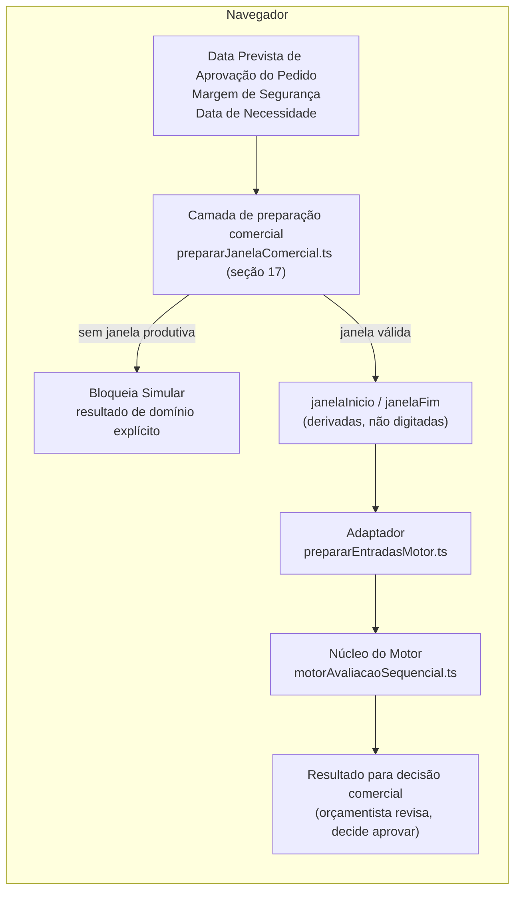
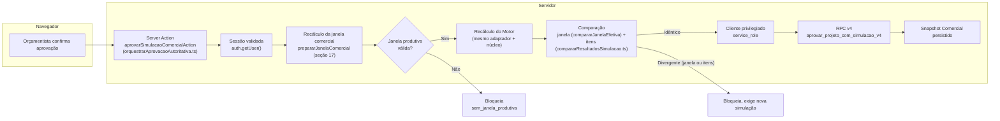
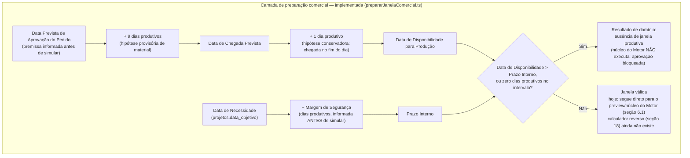

# PAD-008 — Motor de Capacidade

**Data original:** 2026-07-30
**Última revisão:** 2026-08-03
**Versão:** 2.1
**Status:** Vigente
**Natureza do documento:** decisão de arquitetura permanente que descreve as fronteiras, os contratos e as propriedades do Motor de Capacidade, bem como sua realização técnica atual. Referenciado por `DEC-004_Simulacao_Comercial.md`, que trata o Motor apenas como um componente utilizado pela Simulação Comercial, sem descrever sua arquitetura interna — essa descrição é o objeto deste documento.

**Nota de leitura obrigatória:** este documento separa rigorosamente três registros: **Estado atual confirmado** (o que existe e roda hoje, verificado por leitura direta do código), **Decisão aprovada, pendente de implementação** (o que foi decidido, mesmo que ainda não implementado) e **Evolução possível** (o que ainda não foi decidido). Nenhuma seção usa tempo presente para descrever funcionalidade que ainda não existe.

---

## 1. Objetivo

Este documento descreve os componentes reais do Motor de Capacidade e seus contratos de entrada e saída, descrevendo seu comportamento determinístico no núcleo e os limites atuais de reprodução histórica e auditoria. Não é uma proposta de redesenho — exceto pela seção 17, que descreve um comportamento já implementado (Entrega 1), pela seção 19, que descreve um comportamento já implementado (Entrega 2), pela seção 18, que propõe, sem implementar, uma evolução futura ainda pendente, e pela seção 20, que descreve a fronteira arquitetural vigente hoje entre essas camadas — não uma fronteira futura.

## 2. Princípios

**Decisão arquitetural:** os princípios abaixo orientam a arquitetura do Motor de Capacidade e devem ser preservados por qualquer evolução futura:

- **Núcleo único para regras de avaliação** — as regras de consumo sequencial de capacidade, seleção analítica entre recurso original e compatíveis e identificação de déficit pertencem ao núcleo e não devem ser duplicadas pelos consumidores. As regras de preparação das entradas permanecem no adaptador correspondente à origem da demanda.
- **Separação entre cálculo e decisão** — o Motor calcula viabilidade de capacidade; ele não decide aprovação, não assume risco comercial, não escolhe hora extra/terceirização/antecipação de material, e não programa produção. Essas decisões pertencem a quem consome o resultado (ver seção 20, Fronteiras Arquiteturais).
- **Determinismo como princípio permanente** — dado um conjunto de entradas idêntico, o componente responsável sempre produz o mesmo resultado. Este princípio não muda com nenhuma evolução (ver seção 11 para o que muda: o contrato e o algoritmo, não a propriedade de determinismo em si).
- **Resultado por operação de roteiro** — **Estado atual confirmado (Entrega 2):** o cálculo utiliza um item por operação de roteiro, identificado por `bomOperacaoId`. Dentro de uma mesma operação, quando o recurso original não comporta o total, o resultado registra contribuições de 0..N recursos (original + compatíveis, na ordem cadastrada) — a granularidade "1 item por operação" é preservada; cada item deixou de apontar para um único recurso considerado (`recursoConsideradoId` escalar, modelo anterior à Entrega 2) e passou a conter um array `distribuicoes[]` (contrato completo na seção 19).
- **Nenhuma duplicação das regras do núcleo** — qualquer novo consumidor deve utilizar o mesmo núcleo de avaliação e seu contrato, sem reimplementar as regras de seleção analítica de recurso ou cálculo de déficit.

## 3. Consumidores

**Estado atual confirmado:** o único consumidor funcional hoje é a Simulação Comercial, por meio de `executarSimulacao.ts`.

**Evolução possível:** módulos que futuramente precisem avaliar capacidade produtiva poderiam, em tese, reutilizar o núcleo do Motor — sem nomear aqui nenhum módulo específico como compromisso de integração.

## 4. Responsabilidades

**Estado atual confirmado:** o Motor é responsável por:

- Calcular a necessidade de horas de cada operação de roteiro.
- Avaliar se a capacidade disponível comporta essa necessidade.
- Realizar seleção analítica entre o recurso original e os recursos compatíveis cadastrados.
- Identificar déficit por operação — desde a Entrega 2, o déficit pode ser residual (parte da necessidade atendida, parte não), não mais só total ou zero (ver seção 19).
- Retornar o resultado por operação de roteiro.

**Estado atual confirmado (Entrega 2):** distribuir a necessidade de uma operação entre o recurso original e os compatíveis, na ordem de prioridade cadastrada, consumindo a capacidade disponível de cada um até esgotá-la ou até atender à necessidade (seção 19).

**Decisão aprovada, pendente de implementação (seção 18):** dada uma data-limite (Prazo Interno), estimar por engenharia reversa a Data de Início Necessária.

## 5. Não-responsabilidades

**Estado atual confirmado:** o Motor não é responsável por:

- Aprovar a proposta comercial.
- Assumir risco comercial.
- Criar ou programar Ordens de Fabricação.
- Sequenciar produção.
- Definir data e horário operacional.
- Alocar equipe.
- Persistir o snapshot comercial.
- Determinar a disponibilidade real de material — ver seção 17 (hoje: hipótese provisória fixa; no futuro, dado real de Compras).
- Escolher a resposta a um conflito de capacidade ou de material (hora extra, terceirização, antecipação, renegociação de prazo) — o Motor informa fatos; a escolha é sempre do Comercial (seção 20).
- Garantir que a distribuição analítica entre recursos (seção 19) corresponda à alocação real de produção — essa distribuição é estimativa, não execução.
- Programar ou executar produção via PCP — módulo futuro, fora de escopo (seção 20).

## 6. Fluxo real de execução

**Estado atual confirmado — isto descreve só o que existe e roda hoje, incluindo a camada de preparação comercial da seção 17 (implementada, Entrega 1) e a distribuição entre recursos compatíveis da seção 19 (implementada, Entrega 2, descrita nas subseções 6.1/6.2 abaixo). A seção 18 descreve decisão aprovada pendente de implementação, marcada como tal, e não faz parte deste fluxo real. A seção 20 descreve fronteiras arquiteturais permanentes, não um estado pendente.**

O fluxo tem três momentos distintos, com fronteiras de confiança diferentes. Só o terceiro persiste dado oficial.

### 6.1 Preview (cliente, cálculo do Motor, sem persistência)

**Estado atual confirmado (implementado — Entrega 1, ver seção 17):** antes de qualquer execução do núcleo do Motor, uma camada de preparação comercial (seção 17) deriva automaticamente `janelaInicio`/`janelaFim` a partir de três premissas informadas pelo orçamentista **antes** de simular: Data Prevista de Aprovação do Pedido, Margem de Segurança (dias produtivos) e Data de Necessidade (carregada automaticamente de `projetos.data_objetivo` e ajustável nesta tela — o ajuste é uma premissa desta simulação, persistida no snapshot quando aprovada; não atualiza `projetos.data_objetivo` automaticamente). `janelaInicio`/`janelaFim` deixaram de ser digitadas livremente — são sempre o resultado de `prepararJanelaComercial` (`prepararJanelaComercial.ts`), rodando no navegador com o client de sessão do usuário, só para feedback rápido (nenhuma chamada desta etapa persiste nada). O botão "Simular" fica desabilitado enquanto não houver uma janela produtiva válida.

O que ainda não existe (decisão aprovada, pendente de implementação — seção 18): a Data de Início Necessária, calculada por engenharia reversa a partir do Prazo Interno. A janela usada pelo núcleo do Motor hoje é sempre `[dataDisponibilidadeProducao, prazoInterno]`.



### 6.2 Aprovação autoritativa (servidor, persistência)

**Estado atual confirmado (implementado — ver histórico em 7-8, evolução v2→v3→v4 nas Entregas 1-2):** nenhum dado do preview do cliente é confiado para persistência — nem o resultado do Motor, nem a janela comercial. A Server Action recalcula os dois, com o mesmo adaptador e núcleo do Motor e com a mesma camada de preparação comercial (seção 17), agora contra o estado corrente do banco, com a sessão do servidor.



Passos:

- **Validação de payload** (`validarPayloadAprovacao.ts`) roda antes de qualquer consulta de rede — trata o payload como não confiável mesmo com tipos declarados em TypeScript. Inclui, desde a Entrega 1, a Data Prevista de Aprovação do Pedido.
- **Autenticação** — `auth.getUser()` (não `getSession()`) revalida o token contra o servidor de autenticação do Supabase.
- **Recálculo autoritativo da janela comercial** — `prepararJanelaComercial` roda de novo no servidor (seção 17), contra o calendário corrente. Se não houver janela produtiva válida, a aprovação para aqui — o núcleo do Motor nem chega a ser chamado.
- **Recálculo autoritativo do Motor** — `simularCapacidadeProjeto` roda de novo, com `createSupabaseServerClient()` (sessão real do usuário via cookie, RLS normal), sobre a janela recalculada no servidor (nunca a do cliente).
- **Comparação** — a janela efetivamente usada (`compararJanelaEfetiva`) e o resultado por operação (`compararResultadosSimulacao.ts`, DEC-002) são comparados contra o que o cliente enviou. Qualquer divergência, em qualquer um dos dois, bloqueia.
- **Persistência** — só se idêntico nos dois, `createSupabaseServiceClient()` (client `service_role`, nunca exposto ao navegador — `import "server-only"` falha o build se importado por Client Component) chama `aprovar_projeto_com_simulacao_v4` (migration `202608020001`, Entrega 2), enviando **a janela e o resultado recalculados no servidor**, nunca os do cliente, mesmo quando idênticos.
- **Tratamento de erro** — resultados de domínio conhecidos (divergência entre cliente e servidor, ausência de janela produtiva, usuário não autenticado) retornam mensagens específicas, controladas e seguras — nenhuma delas expõe detalhe técnico, mas cada uma informa o motivo de negócio real ao orçamentista (ex.: quais campos divergiram, por que não há janela produtiva). Exceções técnicas inesperadas (falha de persistência, erro não previsto, empresa não encontrada) retornam uma mensagem genérica; o detalhe técnico vai só para `console.error` no servidor, nunca para o navegador.

## 7. Histórico — divergência arquitetural corrigida

**Estado atual confirmado: resolvido.** Este PAD registrava, em sua redação original, um risco real então existente: a revalidação obrigatória (DEC-002/DEC-004) rodava inteiramente no cliente, e a RPC de aprovação (`aprovar_projeto_com_simulacao`, hoje "v1") validava estrutura do payload mas não recomputava os valores contra o estado corrente — o Snapshot Comercial dependia de confiar em cálculo enviado pelo navegador.

Investigação de segurança à época confirmou dois pontos adicionais sobre a v1: `EXECUTE` concedido a `authenticated` (qualquer usuário da empresa, independentemente de papel/cargo, podia aprovar), e atomicidade correta (troca de `projetos.status` e gravação do snapshot na mesma transação — esse ponto nunca foi o problema).

**Classificação histórica:** risco alto de integridade e falha de autorização funcional confirmada.

**Correção implementada** — ver seção 8.

## 8. Decisão arquitetural — implementada

Um Snapshot Comercial oficial não deve depender da confiança em cálculos enviados pelo cliente. Esta decisão **já foi implementada**:

- `aprovarSimulacaoComercialAction.ts` — Server Action que recalcula no servidor antes de persistir (seção 6.2).
- Migration `202607300001` — RPC v2 (`aprovar_projeto_com_simulacao_v2`), `EXECUTE` restrito a `service_role`; empresa do aprovador resolvida exclusivamente de `usuarios.empresa_id`, nunca de parâmetro do chamador; toda entidade referenciada (`bom_operacoes`, recursos) validada contra essa empresa; idempotência real por `(empresa_id, chave_idempotencia)` com índice único parcial e `INSERT ... ON CONFLICT DO NOTHING`, amarrada a um hash de conteúdo (`hash_solicitacao`).
- Migration `202607310001` — corrige o congelamento de custos (`trg_projetos_congelar_custos`), que dependia de `empresa_atual_id()`/`auth.uid()` (sempre `NULL` sob `service_role`); `empresa_id` passa a ser explícito em toda a cadeia.
- Migration `202607310002` — revoga `EXECUTE` de `authenticated` na RPC v1, depois de 7 cenários de teste confirmados por leitura direta no banco. A v1 continua existindo (rollback administrativo rápido via um único `GRANT`), só o caminho de sessão normal foi fechado.
- Migration `202608010001` (Entrega 1, PAD-008 v2.0 §17) — RPC v3 (`aprovar_projeto_com_simulacao_v3`), aditiva sobre a v2: mesma validação estrutural, mesma idempotência, mesmo isolamento de tenant; estende o contrato com as duas premissas novas da camada de preparação comercial (`p_data_prevista_aprovacao_pedido`, `p_data_chegada_prevista`) e passa a receber/persistir `janela_inicio`/`janela_fim` já derivados (colunas reaproveitadas, sem mudança de schema — deixam de significar datas digitadas manualmente e passam a significar Data de Disponibilidade para Produção / Prazo Interno, seção 17). **A v2 permanece preservada tecnicamente** (intacta no banco, mesma ACL de sempre) — mas não é um caminho de rollback funcional direto: seu uso exigiria uma versão da aplicação compatível com o contrato antigo, já que a v2 não conhece `p_data_prevista_aprovacao_pedido`/`p_data_chegada_prevista` nem a semântica atual de `janela_inicio`/`janela_fim`.
- Migration `202608020001` (Entrega 2) — RPC v4 (`aprovar_projeto_com_simulacao_v4`), **aditiva** sobre a v3 (v1/v2/v3 permanecem intactas no banco, sem `EXECUTE` para `authenticated`, como caminho de rollback técnico — nenhuma reescrita, ao contrário do que a seção 19.4 desta revisão anterior previa). Adiciona `versao_resultado_motor` em `simulacao_comercial_itens` (1 = legado escalar, 2 = novo com tabela filha) e a tabela `simulacao_comercial_item_distribuicoes` (0..N linhas por item, uma por recurso participante). Valida a cadeia matemática completa antes de persistir (capacidade efetiva = bruta × produtividade; disponível inicial = max(0, efetiva − comprometido); saldo antes/depois coerente e contínuo por recurso ao longo de toda a simulação; soma das alocações + déficit = necessário), tolerância `0.000001`. Também adiciona `calcular_comprometido_v2` (substitui `calcular_comprometido_v1` como função em uso — v1 preservada, sem alteração, como rollback; corrige forma — soma por recurso via tabela filha, com `UNION` entre snapshots legados e novos — **e** regra de negócio — só projetos com `projetos.situacao_comercial = 'pedido_recebido'` comprometem capacidade, nunca a aprovação interna da Simulação Comercial) e o trigger `trg_projetos_validar_pedido_recebido` (bloqueia a transição para `pedido_recebido` sem uma `simulacoes_comerciais` vigente). `aprovarSimulacaoComercialAction.ts` chama exclusivamente a v4 hoje (commit `62f03c2112539765b3a4441e7395d378048ff2c6`).

**Os pontos residuais abaixo continuam valendo para a v4** — nenhum foi endereçado pela migration `202608020001`:

- **Autorização por cargo** — nenhuma das RPCs (v1 a v4) verifica papel/função do usuário; todas checam só pertencimento à empresa. Evolução possível, sem solução proposta aqui.
- **Janela de concorrência entre cálculo e persistência** — a garantia de que nunca existe mais de uma linha `vigente = true` por projeto vem do índice único parcial `simulacoes_comerciais_vigente_unico` (`on simulacoes_comerciais (projeto_id) where vigente = true`, criado na migration `202607190006`, nunca removido nem alterado desde então — inclusive citado em comentário na própria RPC v2 como o motivo de inserir sempre com `vigente = false` primeiro). Esse índice impede, em qualquer cenário, a coexistência de duas linhas vigentes para o mesmo projeto. Mas a v4 **não serializa** duas aprovações concorrentes reais com chaves de idempotência diferentes (ex.: dois orçamentistas aprovando o mesmo projeto ao mesmo tempo): a sequência de dois `UPDATE` (desativar a vigente anterior, depois ativar a nova) permite que a segunda aprovação a persistir assuma a vigência sem erro, mesmo que a primeira já tivesse sido persistida com sucesso — há prevalência silenciosa da última atualização, sem detecção de conflito nem aviso a nenhum dos dois usuários. **Não se afirma atomicidade completa.** Risco residual conhecido, não corrigido por esta versão; qualquer correção (lock, serialização, recontagem final antes do `UPDATE`) é evolução possível, sem desenho proposto aqui.

## 9. Contratos de entrada e saída (estado atual — distribuição entre recursos, Entrega 2)

**Estado atual confirmado**, por leitura direta de `motorAvaliacaoSequencial.ts`, `executarSimulacao.ts` e `montarPayloadV4.ts`. **Este é o contrato hoje em produção — substitui o modelo de recurso singular (`recursoConsideradoId: string | null`) descrito em revisões anteriores deste documento.**

- Conversão minutos → horas ocorre dentro do núcleo, por operação: `tempoNecessarioHoras = (tempoEstimadoMinutos / 60) * quantidade`.
- O núcleo consome candidatos na ordem: recurso original primeiro (`ordemConsideracao = 0`), depois compatíveis por prioridade cadastrada (`ordemConsideracao = 1..N`), via `Math.min(disponível, restante)` — cada candidato só entra em `distribuicoes[]` quando efetivamente aloca horas (`horasPadraoAlocadas > 0`); candidato sem capacidade disponível no momento avaliado não gera linha vazia.
- `recursoId` é único dentro de `distribuicoes[]` da mesma operação — duplicata é tratada como dado corrompido (`CandidatoDuplicadoError`, `errors.ts`), nunca silenciosamente descartada.
- Déficit total (nenhum recurso comporta nada): `distribuicoes = []`, `deficit = necessario`. Déficit residual (recursos elegíveis esgotados, mas soma alocada < necessário): `distribuicoes` não vazio, `deficit > 0`. Déficit zero: soma de `horasPadraoAlocadas` de `distribuicoes[]` = `necessario`. Os três estados usam o mesmo campo `deficit: number` — não existe mais um campo booleano `deficit` separado do valor numérico.
- Contrato real (`ItemSimulacaoOperacao`, `executarSimulacao.ts`):

```typescript
type ItemSimulacaoOperacao = {
  bomOperacaoId: string;
  recursoOriginalId: string;
  necessario: number;
  deficit: number;
  distribuicoes: DistribuicaoParaPersistencia[];
};

type DistribuicaoParaPersistencia = {
  recursoId: string;
  origem: "ORIGINAL" | "COMPATIBILIDADE";
  ordemConsideracao: number;
  capacidadeBrutaPeriodo: number;
  produtividadeConsiderada: number;
  capacidadeEfetiva: number;
  comprometidoInicial: number;
  capacidadeDisponivelInicial: number;
  capacidadeDisponivelAntes: number;
  horasPadraoAlocadas: number;
  horasMaquinaEstimadas: number;
  capacidadeDisponivelDepois: number;
};
```

- Diferente do contrato originalmente planejado (revisão anterior deste PAD, §19.3): a implementação real congela **toda a base de cálculo** por distribuição (`capacidadeBrutaPeriodo`, `produtividadeConsiderada`, `capacidadeEfetiva`, `comprometidoInicial`, `capacidadeDisponivelInicial`), não só o saldo — decisão mais defensiva que o contrato original previa, para permitir auditoria completa de cada linha do snapshot sem depender de recálculo.
- `EPSILON_HORAS = 0.000001` (`constantesNumericas.ts`) é a tolerância única para toda comparação numérica do módulo — usada no núcleo, na comparação de revalidação (seção 13) e espelhada na RPC (mesmo valor literal, comentado no SQL por não ser importável de lá).
- Granularidade: um item por operação de roteiro (`bomOperacaoId`) em todas as camadas — ver Princípios (seção 2).

**Nota herdada da Entrega 1:** os dois parâmetros `janelaInicio`/`janelaFim` deste contrato são sempre o resultado de `prepararJanelaComercial` (seção 17) — nunca digitados diretamente. O núcleo (`motorAvaliacaoSequencial.ts`) continua recebendo exatamente os mesmos 4 parâmetros de sempre (`empresaId`, `projetoId`, `janelaInicio`, `janelaFim`).

## 10. Sequenciamento

**Estado atual confirmado:** o núcleo processa as operações de roteiro na ordem em que chegam em `operacoesOrdenadas` (itens do projeto por `created_at`, e dentro de cada item, pela ordem do roteiro). Essa ordem, junto com a seleção analítica de recursos (seção 9), determina qual operação recebe capacidade remanescente e qual fica em déficit quando duas operações disputam o mesmo recurso — a ordem afeta o resultado numérico da estimativa.

**Decisão arquitetural:** essa ordem de processamento não constitui sequenciamento real de produção — não há data, horário, alocação persistida, nem consideração de setup entre operações. Isso é coerente com o limite já registrado na Arquitetura Vigente (seção 2): a Simulação Comercial não sequencia operações; isso permanece exclusivo do futuro módulo de PCP.

## 11. Determinismo

**Estado atual confirmado — núcleo:** `motorAvaliacaoSequencial.ts` é determinístico dado um `EntradasMotor` idêntico — função pura, sem I/O, sem dependência de ordem de retorno de rede.

**Estado atual confirmado — adaptador de entradas:** os mesmos 4 parâmetros superficiais (`empresaId`, `projetoId`, `janelaInicio`, `janelaFim`) não garantem o mesmo resultado entre duas execuções, porque `prepararEntradasMotor.ts` lê, a cada chamada, fontes que podem mudar entre uma execução e outra: resolução de dias produtivos (calendário operacional da empresa, calendário oficial de feriados e eventos da empresa, consultados dia a dia sem cache); capacidade diária cadastrada do recurso; produtividade efetiva do recurso ou grupo; comprometido de outros projetos aprovados; compatibilidades cadastradas entre recursos; e a estrutura do roteiro e dos itens do projeto. Alterações nessas fontes podem mudar o resultado, mesmo com os 4 parâmetros idênticos.

A camada de preparação comercial (seção 17), já implementada, não altera o contrato do núcleo nem do adaptador atual — é uma camada nova, anterior a ambos (seção 6.1), com sua própria propriedade de determinismo: dado o mesmo calendário (padrão semanal, feriados e eventos vigentes no momento do cálculo) e as mesmas premissas comerciais, `prepararJanelaComercial` sempre produz o mesmo resultado — mas, como qualquer leitura de calendário (seção 12), esse resultado pode mudar se o calendário mudar entre duas execuções.

**O que já mudou com a seção 19 (Entrega 2, implementada) e o que ainda muda com a seção 18 (futura, não implementada):** o determinismo, como propriedade, é preservado como princípio (seção 2) — qualquer componente novo continua tendo que produzir o mesmo resultado para as mesmas entradas. A seção 19 já mudou o contrato e o algoritmo do núcleo: ele distribui uma operação entre vários recursos (seção 9). O que ainda falta é um componente arquiteturalmente distinto do núcleo atual — o calculador reverso (seção 18) — que vai precisar de capacidade **por dia**, não mais só agregada por janela.

## 12. Reprodutibilidade

**Estado atual confirmado:** para simulações aprovadas, o sistema preserva o resultado histórico por snapshot (`simulacoes_comerciais`/`simulacao_comercial_itens`). Essas linhas preservam o resultado aprovado conforme a regra de negócio vigente e permitem consultar posteriormente a base registrada da decisão — não garantem, porém, a reprodução integral da execução que gerou esse resultado.

O que não fica congelado no snapshot: o BOM e as operações de roteiro originais; os calendários (operacional, oficial e de eventos); a produtividade cadastrada de recursos e grupos; as compatibilidades entre recursos e suas prioridades; as capacidades cadastradas dos recursos; o estado das simulações comerciais vigentes considerado no cálculo do comprometimento; e a versão do algoritmo e das regras do próprio Motor. Qualquer um desses elementos pode mudar depois da aprovação sem que o snapshot registre a mudança — o snapshot preserva o resultado, não as condições exatas que o produziram.

## 13. Critério de revalidação e aprovação

**Estado atual confirmado:** o critério técnico de revalidação — comparação campo a campo por operação de roteiro, com a lista exata de campos persistidos comparados — está detalhado em `DEC-002_Aprovacao_Simulacao_Comercial.md`, seção "Regra de Negócio — Critério de Revalidação". Este documento não repete esse detalhamento. `DEC-004_Simulacao_Comercial.md`, seção "Aprovação (Snapshot)", registra só o princípio geral em nível de negócio (revalidação obrigatória, bloqueio quando algo relevante muda) — sem o detalhamento técnico, que pertence ao DEC-002.

**Adição confirmada nesta revisão (Entrega 1, seção 17):** desde a implementação da camada de preparação comercial, a revalidação autoritativa (seção 6.2) também recalcula e compara a janela comercial (`compararJanelaEfetiva`), além do resultado do Motor por operação — qualquer divergência na janela (ex.: um feriado cadastrado entre o preview e a aprovação) bloqueia a aprovação, pelo mesmo princípio de nunca persistir um cálculo não revalidado no servidor. O critério técnico de comparação dos itens por operação continua definido no DEC-002, sem alteração. O critério de comparação da janela é próprio da camada de preparação comercial (seção 17) e pertence a este PAD-008 — coerente com o DEC-004, que trata a janela comercial como parte do papel do orçamentista, não do critério técnico de revalidação do Motor em si.

**Implementado nesta revisão (Entrega 2):** o critério de comparação passou a considerar a ordem canônica e todos os valores persistidos de `distribuicoes[]` — `compararResultadosSimulacao.ts` compara `necessario`, `deficit` e, para cada distribuição (por `recursoId`, não por posição de array), os 10 campos completos do contrato da seção 9. **Pendência de documentação identificada, fora do escopo desta revisão:** `DEC-002_Aprovacao_Simulacao_Comercial.md` (linha 43) ainda cita `recurso_considerado_id`/`motivo_consideracao` como o critério técnico — desatualizado desde a Entrega 2. Atualizar o DEC-002 é tarefa separada, não incluída nesta revisão do PAD-008.

## 14. Relação com PCP/OF/operações materializadas

**Estado atual confirmado:** o Motor não lê Ordens de Fabricação nem operações de produção materializadas. `calcular_comprometido_v1` considera exclusivamente snapshots de simulações comerciais vigentes. Não existe atualmente PCP operacional nem produção sendo executada pelo sistema.

`ordens_fabricacao.bom_id` estabelece ancestralidade estrutural indireta com o BOM e suas operações. Isso não representa consumo de OF pelo Motor nem integração funcional entre os fluxos.

**Evidência de suporte:** a investigação que fundamenta este estado atual está registrada no HANDOVER-002 (`../HANDOVER-002_NEXOTFE_2026-07-29.md`).

## 15. "Cenário de Execução"

**Estado atual confirmado:** não existe hoje nenhuma estrutura equivalente a "Cenário de Execução". `simularCapacidadeProjeto` recebe só 4 parâmetros (`empresaId`, `projetoId`, `janelaInicio`, `janelaFim`) — nenhum override de recurso, produtividade ou equipe. As entradas atuais são montadas a partir do projeto, BOM, cadastros de capacidade e produtividade, calendários, compatibilidades e snapshots comerciais vigentes.

**Evolução possível:** se "Cenário de Execução" vier a ser construído, seria um conceito genuinamente novo — não uma renomeação de algo existente. Decisão de arquitetura fora do escopo desta versão.

## 16. Auditoria

**Estado atual confirmado:** para simulações aprovadas, o sistema registra os parâmetros comerciais **atualmente suportados**, quem aprovou, quando, e o resultado por operação. Não registra: simulações pré-visualizadas nunca aprovadas; quem rodou uma pré-visualização e quando; o resultado de uma comparação de revalidação que aponta divergência (calculado e exibido na tela, mas não persistido); tentativas de simulação abandonadas antes da aprovação.

**Estado atual confirmado (implementado — Entrega 1, seção 17, migration `202608010001`):** o snapshot (`simulacoes_comerciais`) e sua persistência já incluem, além de Margem de Segurança (já registrada antes desta entrega): Data Prevista de Aprovação do Pedido e Data de Chegada Prevista (colunas novas, `data_prevista_aprovacao_pedido`/`data_chegada_prevista`, nullable — `NULL` em snapshots aprovados antes da Entrega 1, nunca preenchidas retroativamente); Data de Disponibilidade para Produção e Prazo Interno (reaproveitando as colunas já existentes `janela_inicio`/`janela_fim`, sem mudança de schema — a partir da Entrega 1 essas colunas deixam de ser digitadas manualmente e passam a ser sempre derivadas, seção 17). A tela de leitura de uma simulação já aprovada (`SimulacaoCapacidade.tsx`) trata explicitamente o caso `NULL` das duas colunas novas, exibindo "— (simulação anterior à Entrega 1)". Idempotência (`chave_idempotencia`/`hash_solicitacao`) continua o mesmo mecanismo já registrado nesta seção antes desta revisão — o hash canônico passou a incluir também as novas premissas e a janela recalculada no servidor, sem mudar o mecanismo em si.

**Implementado nesta revisão (Entrega 2, migration `202608020001`):** as distribuições por recurso já fazem parte do snapshot — `simulacao_comercial_itens.versao_resultado_motor = 2` mais 0..N linhas em `simulacao_comercial_item_distribuicoes`. Snapshots aprovados antes da Entrega 2 permanecem `versao_resultado_motor = 1` (formato legado, sintetizado na leitura — ver `carregarSnapshotPersistido.ts`), nunca migrados retroativamente.

**Decisão aprovada, pendente de implementação (seção 18):** Data de Início Necessária ainda não existe em nenhuma camada — continua fora do snapshot até essa seção ser implementada.

**Fora do escopo:** este PAD não decide persistir pré-visualizações. Essa eventual decisão exige avaliação específica de finalidade, volume, retenção, privacidade e custo operacional.

## 17. Fluxo de preparação da solicitação (implementado — Entrega 1)

**Implementado na Entrega 1** (commit `3da17b3dab459f460a5811ae168a2b3373a98f67`; migration `202608010001_aprovar_projeto_com_simulacao_v3_janela_comercial.sql`; fechamento registrado em `../HANDOVER-003_NEXOTFE_2026-08-02.md`, commit `e4bb2f36d456a492fc06e1d4acd28906091dfc25`). Esta seção descreve, como implementado hoje, o contrato originado em `DEC-004_Simulacao_Comercial.md` — não repete a justificativa de negócio, registrada lá.

### 17.1 Camada de preparação comercial — escopo

Uma camada (`prepararJanelaComercial.ts`), anterior ao preview (seção 6.1) e arquiteturalmente distinta do núcleo do Motor (seção 20), recebe três entradas, informadas antes de qualquer chamada ao núcleo do Motor:

- **Data Prevista de Aprovação do Pedido** — premissa nova desta entrega (seção 17.4).
- **Margem de Segurança** (dias produtivos) — premissa já existente, migrada de parâmetro pós-simulação para pré-requisito (seção 17.3).
- **Data de Necessidade** (`projetos.data_objetivo`, carregada automaticamente do projeto e ajustável na tela de Simulação — seção 6.1).

A partir dessas três entradas, a camada calcula a Data de Chegada Prevista, a Data de Disponibilidade para Produção e o Prazo Interno, e valida a existência de uma janela produtiva — no cliente (preview, seção 6.1) e de novo no servidor (aprovação autoritativa, seção 6.2).



### 17.2 Todas as datas em dias produtivos, com dia-zero definido

**Decisão de negócio (DEC-004):** margem de segurança, criação da requisição, realização da compra, prazo de chegada do material, liberação do material para produção, cálculo reverso da data necessária de início, e capacidade disponível em cada recurso — todos contados em dias produtivos, respeitando o calendário operacional vigente da empresa (`resolverDiaProdutivo`, sem duplicar a regra de precedência).

**Contrato arquitetural — semântica de deslocamento, fechada:**

- A data-base de qualquer deslocamento nunca é contada como um dos dias deslocados.
- A contagem começa no primeiro dia produtivo posterior (deslocamento positivo) ou anterior (deslocamento negativo).
- Deslocamento zero é a própria data-base, sem consultar o calendário:

```text
deslocarDiasProdutivos(dataBase, 0) = dataBase
```

**Estado atual confirmado (implementado):** a função que desloca uma data por N dias produtivos (positivo, negativo ou zero) existe — `deslocarDiasProdutivos` (`src/modules/calendario/lib/deslocarDiasProdutivos.ts`), coberta por testes automatizados que confirmam exatamente este contrato (base nunca conta, positivo/negativo, deslocamento zero, feriado, evento de dia trabalhado excepcional, limite defensivo).

**Correção de performance registrada nesta revisão:** a implementação inicial fazia até 4 consultas ao Supabase **por dia civil examinado** (não por dia produtivo) — 124 consultas medidas no cenário real da Entrega 1. Corrigido antes do commit `3da17b3`: `contextoCalendario.ts` carrega o calendário do intervalo inteiro em lote (`carregarContextoCalendario`) e resolve os dias em memória (`resolverDiaProdutivoComContexto`, única fonte da regra de precedência — `resolverDiaProdutivo` virou um wrapper fino sobre ela); `prepararJanelaComercial.ts` compartilha um único contexto entre os três deslocamentos da janela e a contagem final de dias produtivos. Resultado, confirmado contra o banco remoto real: **4 consultas no cenário normal**, independente da distância entre as datas. Consultas adicionais só ocorrem por **paginação** (`.range()`, lotes de 500, ordenação determinística `data`+`id` — defesa contra o teto de linhas por resposta do Supabase, `api.max_rows`) ou por **expansão** (calendário atípico em que a estimativa inicial de janela não basta, limitada por `MAX_DIAS_CIVIS_EXAMINADOS`) — em ambos os casos o crescimento é por página/lote, nunca por dia civil. Detalhamento completo em `../HANDOVER-003_NEXOTFE_2026-08-02.md`.

### 17.3 Prazo interno

```text
prazoInterno = dataNecessidade − margemSegurancaDiasProdutivos
```

Exemplo confirmado: Data de necessidade 30/11/2026, margem 3 dias produtivos → prazo interno 25/11/2026.

**Estado atual confirmado (implementado):** o campo "Margem de Segurança" migrou de "parâmetro pós-simulação" para pré-requisito de execução — em `SimulacaoCapacidade.tsx`, é informado junto com a Data Prevista de Aprovação do Pedido, antes do botão "Simular" ficar habilitado. Validação defensiva implementada: número inteiro, não negativo (`prepararJanelaComercial.ts` lança `RangeError` caso contrário). **Limite máximo de negócio: continua não existindo** — só a mesma defesa técnica de antes (`MAX_MARGEM_SEGURANCA_DIAS = 3650`, ainda explicitamente "não regra de negócio" no comentário do código, inalterado por esta entrega). Definir esse limite continua pendência de negócio em aberto, não decidida aqui.

### 17.4 Disponibilidade provisória de material

```text
dataChegadaPrevista = dataAprovacaoPrevista + 9 dias produtivos
dataDisponibilidadeProducao = deslocarDiasProdutivos(dataChegadaPrevista, +1)
```

Decomposição dos 9 dias (decisão de negócio, DEC-004): 1 dia produtivo para criar a requisição, 1 dia produtivo para realizar a compra, 7 dias produtivos para chegada prevista do material. Na regra provisória atual, `dataDisponibilidadeProducao` equivale a `dataAprovacaoPrevista + 10 dias produtivos` — a chegada e a disponibilidade para produção são dois fatos distintos, documentados separadamente.

**Estado atual confirmado (implementado):** o campo "Data Prevista de Aprovação do Pedido" existe no formulário (`SimulacaoCapacidade.tsx`), no payload de aprovação (`validarPayloadAprovacao.ts`) e no snapshot persistido (`simulacoes_comerciais.data_prevista_aprovacao_pedido`, migration `202608010001`) — distinto de `situacao_comercial` (fato observado, não previsão) e de `data_objetivo`/Data de Necessidade (data de entrega), exatamente como decidido. **Não existe em `projetos`** — é uma premissa por simulação, não um campo do projeto, decisão preservada da redação original desta seção.

**Evolução possível:** quando Compras existir, `dataChegadaPrevista` e `dataDisponibilidadeProducao` deverão vir do fluxo real de requisição/cotação/pedido/previsão de entrega — substituindo os 9 dias fixos, sem alterar a arquitetura desta seção. Mesmo princípio já registrado em Arquitetura Vigente §17. Sem data ou roadmap fechado.

### 17.5 Ausência de janela produtiva × conflito de material

**Estado atual confirmado (implementado, comportamento coberto por testes automatizados):**

Duas situações diferentes, com efeitos diferentes:

- **Conflito de material dentro de uma janela que existe** (`dataDisponibilidadeProducao <= prazoInterno`, mas a capacidade real na janela não é suficiente): não é bloqueado aqui — o núcleo do Motor executa normalmente e informa o déficit (seção 18.1). Tratado como déficit comum, sujeito à confirmação explícita do orçamentista (DEC-004).
- **Ausência total de janela produtiva**: o núcleo do Motor **não executa** quando:

```text
dataDisponibilidadeProducao > prazoInterno
```

Também não executa quando o intervalo entre as duas datas contiver zero dias produtivos — mesmo que `dataDisponibilidadeProducao <= prazoInterno` em termos de calendário civil. O caso "início igual a fim" não é automaticamente um resultado válido de capacidade zero: se esse único dia não for produtivo, o contrato retorna ausência de janela produtiva, não uma simulação com capacidade zero. Se `dataDisponibilidadeProducao === prazoInterno`, executa somente se esse dia for produtivo.

Em qualquer caso de ausência de janela: retorna um **resultado de domínio explícito** — não uma exceção genérica (`RangeError` cru) e não um botão silenciosamente desabilitado sem explicação. Não existe simulação válida para aprovar (DEC-004, "Déficit × ausência de janela"). Formato exato (tipo TypeScript, mensagem) é decisão aprovada, pendente de implementação.

## 18. Calculador reverso baseado em capacidade diária

**Confirmado nesta auditoria (2026-08-02): nenhuma linha desta seção foi implementada pela Entrega 1.** A própria migration `202608010001` registra isso explicitamente, tanto no cabeçalho quanto no comentário da função v3: *"Distribuicao parcial entre recursos e calculador reverso diario (PAD-008 v2.0 secoes 18-19) permanecem FORA do escopo desta migration/funcao - recurso_considerado_id continua singular."*

Este componente é **arquiteturalmente distinto** do núcleo de distribuição sequencial descrito nas seções 9 e 19 — não é "o mesmo núcleo rodando ao contrário". O núcleo atual (e sua evolução na seção 19) recebe capacidade já **agregada por janela** (um único número de horas disponíveis por recurso, calculado uma vez a partir de `diasProdutivos × capacidadeDiaria × produtividade`). O cálculo reverso precisa de capacidade **por dia individual**, para poder caminhar dia a dia a partir do Prazo Interno — uma representação de dado que o adaptador atual (`prepararEntradasMotor.ts`) não produz. Tratar os dois como o mesmo componente seria impreciso.

**Decisão aprovada:** a existência deste componente e sua fronteira arquitetural (seção 20) — distinto do núcleo de distribuição, operando sobre capacidade diária em vez de capacidade agregada por janela — estão decididas. Isso não é uma possibilidade em aberto; é decisão de negócio confirmada (DEC-004), com contrato arquitetural registrado aqui.

**Pendência de desenho e implementação:** o algoritmo diário que efetivamente calcula, dia a dia, a Data de Início Necessária, não está desenhado. Este PAD registra a decisão de negócio e a fronteira arquitetural — não descreve o algoritmo como se ele já existisse ou como se fosse uma extensão trivial do núcleo sequencial atual.

A Arquitetura Vigente §17 já registrava este conceito como "Motor de Engenharia Reversa / Motor V2", explicitamente fora do escopo da v1.0/v1.1, "a ser tratada em ciclo próprio". Esta seção registra que parte desse escopo passa a ser decisão aprovada deste PAD — sem declarar que a Arquitetura Vigente estava errada sobre o estado atual, e sem resolver a sobreposição de escopo entre os dois documentos, que fica registrada como ponto de coerência documental a tratar, fora do escopo desta revisão.

**Decisão de negócio (DEC-004):** partindo do Prazo Interno (seção 17.3), este componente deve consumir capacidade disponível de trás para frente para estimar a Data de Início Necessária — **um limite analítico comercial estimado, não programação executável nem garantia de data do PCP.**

**Invariante herdado da Arquitetura Vigente §17 (Motor V2), preservado aqui:** a Compatibilidade entre Recursos Produtivos já é parte do núcleo atual (seção 9); o cálculo reverso deve preservar essa lógica — para cada operação, se o recurso original não tiver capacidade disponível na data sendo avaliada, o cálculo reverso consulta a lista de recursos compatíveis, na mesma ordem de prioridade usada hoje para frente.

**O calculador reverso deverá utilizar o mesmo contrato de distribuição parcial já implementado na seção 19: recurso original primeiro e, depois, consumo parcial dos compatíveis na prioridade cadastrada — não a seleção binária anterior à Entrega 2, já substituída.**

### 18.1 Comparação com a disponibilidade de material

Depois de calculada a Data de Início Necessária, compara-se:

```text
dataDisponibilidadeProducao <= dataInicioNecessaria
```

- Se verdadeiro: o material não bloqueia o início necessário.
- Se falso: existe **conflito de material dentro de uma janela que existe** (não ausência de janela — ver seção 17.5). O componente deve recalcular a capacidade utilizável a partir da disponibilidade real do material e informar: horas necessárias; horas disponíveis; déficit; a diferença entre o início necessário e a disponibilidade do material; os recursos considerados; e a eventual quantidade de horas adicionais necessárias para resolver o conflito.

**O Motor informa os fatos. Ele não decide hora extra, terceirização, antecipação de material ou renegociação da entrega** — mesma fronteira já registrada em DEC-004, "Princípio".

## 19. Distribuição parcial entre recursos compatíveis (implementado — Entrega 2)

**Implementado na Entrega 2** (migration `202608020001_simulacao_comercial_distribuicao_parcial.sql`, commit `70d5f61f66775b42ba4ce11d7a4533d48886aaa8`; núcleo e leitura dupla no commit `cbc9a718177be90b90b913bf3dcb2813e90d32f6`; ativação da persistência nativa via RPC v4 no commit `62f03c2112539765b3a4441e7395d378048ff2c6`; fechamento registrado em `../HANDOVER-004_NEXOTFE_2026-08-03.md`).

### 19.1 Histórico da divergência (resolvida)

Revisões anteriores deste documento registravam aqui uma divergência confirmada entre a intenção de negócio (distribuição parcial, DEC-004) e a implementação então existente (substituição binária — o Motor escolhia um único recurso que comportasse a operação inteira, `break` no primeiro candidato que passasse no teste `>=`). Essa divergência **foi corrigida pela Entrega 2** — não existe mais.

### 19.2 Regra de negócio implementada (DEC-004)

- O Motor distribui as horas primeiro no recurso original.
- O saldo segue pelos recursos compatíveis, respeitando a prioridade cadastrada.
- Cada recurso consome apenas sua capacidade disponível — nunca mais do que isso.
- O déficit é somente o saldo que permanecer após esgotar todos os recursos elegíveis.
- A distribuição é analítica para a Simulação Comercial; não é sequenciamento definitivo do PCP.

```text
horasConsideradas = mínimo(saldoNecessario, capacidadeDisponivel)
saldoNecessario   = saldoNecessario − horasConsideradas
```

**Exemplo ilustrativo** (referência conceitual, não uma execução real):

```text
Necessidade: 200 horas
Torno 1, original:                disponível 140h → consome 140h → saldo 60h
Torno 2, compatível prioridade 1: disponível  40h → consome  40h → saldo 20h
Torno 3, compatível prioridade 2: disponível  50h → consome  20h → saldo  0h
Déficit: zero. Capacidade remanescente do Torno 3: 30 horas.
```

**Exemplo real, confirmado por teste E2E** (projeto de teste `260009`, operação de 120 horas-padrão, produtividade 85% nos três recursos):

```text
FCNC-003, original:                52,36 horas-padrão alocadas
FCNC-002, compatível prioridade 1: 52,36 horas-padrão alocadas
FCNC-004, compatível prioridade 2: 15,28 horas-padrão alocadas
Soma: 120 horas-padrão. Déficit: zero.
```

Snapshot persistido `19c364ad-6a0b-45c6-9ad9-a1c81c9cd756`: 1 item (`versao_resultado_motor = 2`), 3 distribuições, ordens `0/1/2`. Replay com a mesma chave de idempotência retornou o mesmo ID, sem duplicação. Projeto permaneceu `situacao_comercial = consulta` durante todo o teste — não comprometeu capacidade de nenhum recurso (confirmado por leitura direta: `calcular_comprometido_v2` só conta projetos com `situacao_comercial = 'pedido_recebido'`).

### 19.3 Contrato implementado (estado atual confirmado)

O contrato real, tal como implementado, está descrito na seção 9 (`ItemSimulacaoOperacao`/`DistribuicaoParaPersistencia`) — não repetido aqui. Principais diferenças em relação ao contrato originalmente desenhado (revisões anteriores deste PAD, antes da implementação): nomes de campo diferentes (`necessario`/`deficit` em vez de `horasNecessarias`/`deficitHoras`; `horasPadraoAlocadas` em vez de `horasConsideradas`; `capacidadeDisponivelAntes`/`Depois` em vez de `horasDisponiveisAntes`/`Depois`); `origem: "COMPATIBILIDADE"` em vez de `"COMPATIVEL"`; sem campo `viavel` próprio (inferido por `deficit === 0`); base de cálculo completa (bruta/produtividade/efetiva/comprometido) congelada por distribuição, não só o saldo.

Regras que fecham o contrato, confirmadas em produção:

- `recursoId` é único dentro de `distribuicoes` da mesma operação — violação é `CandidatoDuplicadoError` (núcleo) ou rejeitada pela constraint `simulacao_comercial_item_distribuicoes_recurso_unico` (banco).
- Um recurso só ganha uma entrada em `distribuicoes` quando `horasPadraoAlocadas > 0`.
- `distribuicoes` é sempre serializada e persistida ordenada por `ordemConsideracao` ascendente.
- **Comparação de revalidação** (`compararResultadosSimulacao.ts`, DEC-002 pendente de atualização formal — ver seção 13): duas execuções são idênticas para uma operação quando `necessario`, `deficit` são iguais (tolerância `EPSILON_HORAS`) **e** `distribuicoes` são iguais elemento a elemento, comparadas por `recursoId` (não por posição), incluindo diferença de tamanho como divergência.
- **Consistência aritmética**, validada tanto no núcleo/hash quanto na RPC antes de persistir: soma de `horasPadraoAlocadas` + `deficit` = `necessario`; `capacidadeDisponivelDepois` = `capacidadeDisponivelAntes − horasPadraoAlocadas`; `capacidadeEfetiva` = `capacidadeBrutaPeriodo × produtividadeConsiderada`; `capacidadeDisponivelInicial` = `max(0, capacidadeEfetiva − comprometidoInicial)` — todas com tolerância `0.000001`.
- **Hash de solicitação** (`orquestrarAprovacaoAutoritativa.ts`, `calcularHashSolicitacao`): serializa as operações ordenadas por `bomOperacaoId` e, dentro de cada uma, `distribuicoes` ordenadas por `recursoId` — determinístico por construção, `sha256`.

### 19.4 Impacto de implementação — concluído

Todos os itens abaixo, listados como pendência em revisões anteriores, foram implementados:

- Núcleo do Motor (`motorAvaliacaoSequencial.ts`) — algoritmo de consumo parcial.
- `ItemSimulacaoOperacao`/`ResultadoSimulacao` (`executarSimulacao.ts`) — contrato multi-recurso.
- `prepararResultadoParaExibicao.ts` e `SimulacaoCapacidade.tsx` — tabela hierárquica operação → recursos.
- `compararResultadosSimulacao.ts` — critério fechado em 19.3.
- `validarPayloadAprovacao.ts` — validação do array aninhado e consistência de forma.
- Hash de solicitação — serialização determinística.
- **RPC v4 aditiva** (`aprovar_projeto_com_simulacao_v4`) — não uma reescrita de v2, como revisões anteriores previam; v1/v2/v3 preservadas intactas como caminho de rollback técnico.
- Migration `202608020001` — coluna `versao_resultado_motor` em `simulacao_comercial_itens`; tabela nova `simulacao_comercial_item_distribuicoes`; `calcular_comprometido_v2`; trigger `trg_projetos_validar_pedido_recebido`.
- Testes automatizados: 63 testes no módulo `simulacao-comercial` (7 arquivos), cobrindo núcleo, comparação, leitura dupla de snapshot, mapeamento para o payload v4, e idempotência do orquestrador.

**Limitação conhecida, não corrigida por esta entrega:** ver §8, "Janela de concorrência entre cálculo e persistência" — continua valendo para a v4.

## 20. Fronteiras arquiteturais

**Decisão arquitetural**, separando quatro camadas distintas — não três:

- **Camada de preparação comercial** (seção 17, **implementada — Entrega 1**): recebe a Margem de Segurança e a Data Prevista de Aprovação do Pedido; calcula a Data de Chegada Prevista e a Data de Disponibilidade para Produção; calcula o Prazo Interno; valida a existência de uma janela produtiva antes de acionar qualquer cálculo de capacidade.
- **Núcleo de distribuição analítica entre recursos** (seções 9 e 19): recebe capacidade **agregada por janela**; distribui a necessidade de cada operação entre o recurso original e os compatíveis; calcula déficit. **Implementado na Entrega 2** — é o núcleo atualmente em produção, distinto do calculador reverso abaixo.
- **Calculador reverso baseado em capacidade diária** (seção 18): componente arquiteturalmente distinto do núcleo acima, com existência e fronteira decididas mas algoritmo ainda sem desenho; precisaria de capacidade **por dia**, não agregada, para caminhar de trás para frente a partir do Prazo Interno e estimar a Data de Início Necessária.
- **Fluxo comercial de decisão e aprovação** (DEC-004, seção 6.2): o orçamentista informa premissas, avalia o resultado apresentado, decide aprovar ou não — inclusive sob déficit ou sob conflito de material assumido conscientemente.

**PCP** é módulo futuro, fora de escopo — mencionado só para delimitar a fronteira, igual à Arquitetura Vigente §2 e ao DEC-004, "Limites do módulo". Nenhuma das camadas acima define ou antecipa seu funcionamento.

A distribuição analítica entre recursos (seção 19) e a estimativa reversa (seção 18) não constituem alocação definitiva nem sequenciamento — são estimativas de viabilidade comercial, sujeitas a mudar completamente quando o PCP real distribuir a produção.

## 21. Evolução possível

Sem compromisso de roadmap:

- Reutilização do núcleo por outros módulos que venham a precisar avaliar capacidade produtiva (seção 3).
- Construção de um conceito de "Cenário de Execução" (seção 15).
- Integração entre o Motor e PCP/Ordens de Fabricação/operações de produção materializadas (seção 14).
- Persistência de pré-visualizações não aprovadas (seção 16), sujeita à avaliação descrita ali.
- Substituição dos 9 dias produtivos fixos pelo dado real de Compras (seção 17.4), sem data ou roadmap fechado.
- Correção da janela de concorrência residual entre cálculo e persistência (seção 8) — continua válida para a v4, não corrigida pela Entrega 2.
- Autorização por cargo na aprovação (seção 8).
- Atualização formal do critério de revalidação do DEC-002 para o contrato de 19.3.
- Reconciliação de escopo entre a seção 18 e a Arquitetura Vigente §17 quanto a "Motor V2" — não resolvida aqui.

Nenhuma das possibilidades acima é decidida por esta versão do documento. O algoritmo diário do calculador reverso (seção 18) não é uma dessas possibilidades: sua existência é decisão aprovada; só o desenho do algoritmo é pendência, não listado aqui para não sugerir que a decisão em si ainda está em aberto.

## 22. Referências

- `ARQUITETURA_VIGENTE_SIMULACAO_COMERCIAL_CAPACIDADE.md` — seções 2 (Princípio Fundamental), 7 (Calendário Operacional), 17 (Evolução Futura, incluindo a menção original a Motor V2/engenharia reversa e disponibilidade de matéria-prima), 18 (Compatibilidade entre Recursos Produtivos e Motor de Avaliação Sequencial).
- `DEC-002_Aprovacao_Simulacao_Comercial.md` — critério técnico de revalidação (seção 13 deste documento).
- `DEC-004_Simulacao_Comercial.md` — papéis de negócio da Simulação Comercial; referencia este documento para a arquitetura interna do Motor; origem de negócio das regras das seções 17-19.
- `../HANDOVER-002_NEXOTFE_2026-07-29.md` — investigação original que originou este PAD, incluindo achados sobre o estado do repositório não repetidos aqui.
- `supabase/migrations/202608010001_aprovar_projeto_com_simulacao_v3_janela_comercial.sql` — RPC v3 e colunas de janela comercial (seção 17).
- Commit `3da17b3dab459f460a5811ae168a2b3373a98f67` — implementação completa da Entrega 1 (janela comercial + correção de performance de calendário).
- `../HANDOVER-003_NEXOTFE_2026-08-02.md` (commit `e4bb2f36d456a492fc06e1d4acd28906091dfc25`) — fechamento da Entrega 1, teste ponta a ponta real contra o banco remoto, pendências registradas.
- `supabase/migrations/202608020001_simulacao_comercial_distribuicao_parcial.sql` — RPC v4, `versao_resultado_motor`, tabela `simulacao_comercial_item_distribuicoes`, `calcular_comprometido_v2` (seção 19).
- Commits `70d5f61f66775b42ba4ce11d7a4533d48886aaa8` (schema), `cbc9a718177be90b90b913bf3dcb2813e90d32f6` (núcleo + leitura dupla), `62f03c2112539765b3a4441e7395d378048ff2c6` (ativação da RPC v4) — implementação completa da Entrega 2.
- `../HANDOVER-004_NEXOTFE_2026-08-03.md` — fechamento da Entrega 2, teste ponta a ponta real contra o banco remoto (projeto `260009`), replay de idempotência confirmado, auditoria final do diff.
