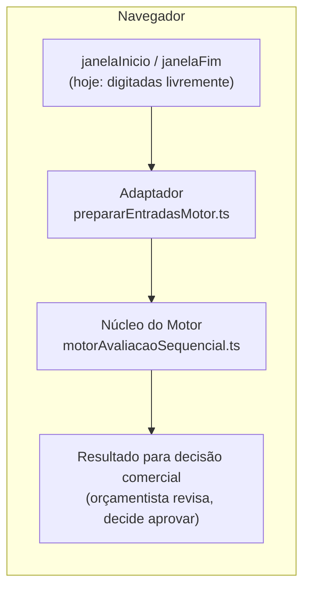
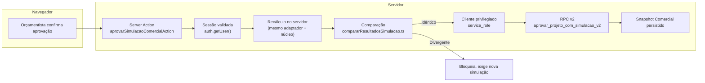
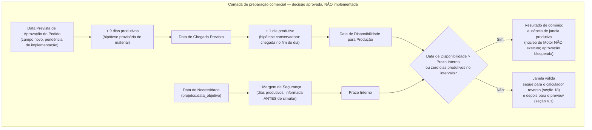

# PAD-008 — Motor de Capacidade

**Data original:** 2026-07-30
**Última revisão:** 2026-08-01
**Versão:** 2.0
**Status:** Vigente
**Natureza do documento:** decisão de arquitetura permanente que descreve as fronteiras, os contratos e as propriedades do Motor de Capacidade, bem como sua realização técnica atual. Referenciado por `DEC-004_Simulacao_Comercial.md`, que trata o Motor apenas como um componente utilizado pela Simulação Comercial, sem descrever sua arquitetura interna — essa descrição é o objeto deste documento.

**Nota de leitura obrigatória:** este documento separa rigorosamente três registros: **Estado atual confirmado** (o que existe e roda hoje, verificado por leitura direta do código), **Decisão aprovada, pendente de implementação** (o que foi decidido, mesmo que ainda não implementado) e **Evolução possível** (o que ainda não foi decidido). Nenhuma seção usa tempo presente para descrever funcionalidade que ainda não existe.

---

## 1. Objetivo

Este documento descreve os componentes reais do Motor de Capacidade e seus contratos de entrada e saída, descrevendo seu comportamento determinístico no núcleo e os limites atuais de reprodução histórica e auditoria. Não é uma proposta de redesenho — exceto pelas extensões explicitamente marcadas como decisão aprovada pendente de implementação nas seções 17-20, que propõem, sem implementar, a evolução necessária para incorporar as decisões de negócio registradas em `DEC-004_Simulacao_Comercial.md`.

## 2. Princípios

**Decisão arquitetural:** os princípios abaixo orientam a arquitetura do Motor de Capacidade e devem ser preservados por qualquer evolução futura:

- **Núcleo único para regras de avaliação** — as regras de consumo sequencial de capacidade, seleção analítica entre recurso original e compatíveis e identificação de déficit pertencem ao núcleo e não devem ser duplicadas pelos consumidores. As regras de preparação das entradas permanecem no adaptador correspondente à origem da demanda.
- **Separação entre cálculo e decisão** — o Motor calcula viabilidade de capacidade; ele não decide aprovação, não assume risco comercial, não escolhe hora extra/terceirização/antecipação de material, e não programa produção. Essas decisões pertencem a quem consome o resultado (ver seção 20, Fronteiras Arquiteturais).
- **Determinismo como princípio permanente** — dado um conjunto de entradas idêntico, o componente responsável sempre produz o mesmo resultado. Este princípio não muda com nenhuma evolução (ver seção 11 para o que muda: o contrato e o algoritmo, não a propriedade de determinismo em si).
- **Resultado por operação de roteiro** — Estado atual confirmado: o cálculo utiliza um item por operação de roteiro, identificado por `bomOperacaoId`. **Decisão aprovada, pendente de implementação (seção 19):** dentro de uma mesma operação, quando o recurso original não comporta o total, o resultado passa a registrar contribuições de mais de um recurso compatível — a granularidade "1 item por operação" é preservada; o que muda é que cada item deixa de apontar para um único recurso considerado.
- **Nenhuma duplicação das regras do núcleo** — qualquer novo consumidor deve utilizar o mesmo núcleo de avaliação e seu contrato, sem reimplementar as regras de seleção analítica de recurso ou cálculo de déficit.

## 3. Consumidores

**Estado atual confirmado:** o único consumidor funcional hoje é a Simulação Comercial, por meio de `executarSimulacao.ts`.

**Evolução possível:** módulos que futuramente precisem avaliar capacidade produtiva poderiam, em tese, reutilizar o núcleo do Motor — sem nomear aqui nenhum módulo específico como compromisso de integração.

## 4. Responsabilidades

**Estado atual confirmado:** o Motor é responsável por:

- Calcular a necessidade de horas de cada operação de roteiro.
- Avaliar se a capacidade disponível comporta essa necessidade.
- Realizar seleção analítica entre o recurso original e os recursos compatíveis cadastrados.
- Identificar déficit por operação (hoje: total ou zero — ver seção 19 para a evolução a déficit parcial).
- Retornar o resultado por operação de roteiro.

**Decisão aprovada, pendente de implementação (seções 17-19):** distribuir parcialmente a necessidade de uma operação entre o recurso original e os compatíveis, na ordem de prioridade cadastrada; e, dada uma data-limite (Prazo Interno), estimar por engenharia reversa a Data de Início Necessária.

## 5. Não-responsabilidades

**Estado atual confirmado:** o Motor não é responsável por:

- Aprovar a proposta comercial.
- Assumir risco comercial.
- Criar ou programar Ordens de Fabricação.
- Sequenciar produção.
- Definir data e horário operacional.
- Alocar equipe.
- Persistir o snapshot comercial.
- Determinar a disponibilidade real de material — ver seção 17 (hoje: hipótese provisória fixa; no futuro, dado real de Compras).
- Escolher a resposta a um conflito de capacidade ou de material (hora extra, terceirização, antecipação, renegociação de prazo) — o Motor informa fatos; a escolha é sempre do Comercial (seção 20).
- Garantir que a distribuição analítica entre recursos (seção 19) corresponda à alocação real de produção — essa distribuição é estimativa, não execução.
- Programar ou executar produção via PCP — módulo futuro, fora de escopo (seção 20).

## 6. Fluxo real de execução

**Estado atual confirmado — isto descreve só o que existe e roda hoje. As seções 17-20 descrevem decisão aprovada pendente de implementação, marcada como tal, e não fazem parte deste fluxo real.**

O fluxo tem três momentos distintos, com fronteiras de confiança diferentes. Só o terceiro persiste dado oficial.

### 6.1 Preview (cliente, cálculo do Motor, sem persistência)

Hoje, `janelaInicio`/`janelaFim` são digitadas livremente pelo orçamentista em dois campos de data (`SimulacaoCapacidade.tsx`) — não existe ainda nenhum cálculo de Prazo Interno, disponibilidade de material ou engenharia reversa (isso é decisão aprovada pendente de implementação, seções 17-18). Com essas duas datas, o preview roda inteiramente no navegador, para feedback rápido — nenhuma chamada desta etapa persiste nada.



### 6.2 Aprovação autoritativa (servidor, persistência)

**Estado atual confirmado (implementado — ver histórico em 7-8):** nenhum dado do preview do cliente é confiado para persistência. A Server Action recalcula com o mesmo adaptador e núcleo, agora contra o estado corrente do banco, com a sessão do servidor.



Passos:

- **Validação de payload** (`validarPayloadAprovacao.ts`) roda antes de qualquer consulta de rede — trata o payload como não confiável mesmo com tipos declarados em TypeScript.
- **Autenticação** — `auth.getUser()` (não `getSession()`) revalida o token contra o servidor de autenticação do Supabase.
- **Recálculo autoritativo** — `simularCapacidadeProjeto` roda de novo, com `createSupabaseServerClient()` (sessão real do usuário via cookie, RLS normal).
- **Comparação** — `compararResultadosSimulacao.ts` compara o resultado do cliente com o recalculado no servidor, campo a campo por operação (DEC-002). Divergência bloqueia.
- **Persistência** — só se idêntico, `createSupabaseServiceClient()` (client `service_role`, nunca exposto ao navegador — `import "server-only"` falha o build se importado por Client Component) chama `aprovar_projeto_com_simulacao_v2`, enviando **o resultado recalculado no servidor**, nunca o do cliente, mesmo quando idênticos.

## 7. Histórico — divergência arquitetural corrigida

**Estado atual confirmado: resolvido.** Este PAD registrava, em sua redação original, um risco real então existente: a revalidação obrigatória (DEC-002/DEC-004) rodava inteiramente no cliente, e a RPC de aprovação (`aprovar_projeto_com_simulacao`, hoje "v1") validava estrutura do payload mas não recomputava os valores contra o estado corrente — o Snapshot Comercial dependia de confiar em cálculo enviado pelo navegador.

Investigação de segurança à época confirmou dois pontos adicionais sobre a v1: `EXECUTE` concedido a `authenticated` (qualquer usuário da empresa, independentemente de papel/cargo, podia aprovar), e atomicidade correta (troca de `projetos.status` e gravação do snapshot na mesma transação — esse ponto nunca foi o problema).

**Classificação histórica:** risco alto de integridade e falha de autorização funcional confirmada.

**Correção implementada** — ver seção 8.

## 8. Decisão arquitetural — implementada

Um Snapshot Comercial oficial não deve depender da confiança em cálculos enviados pelo cliente. Esta decisão **já foi implementada**:

- `aprovarSimulacaoComercialAction.ts` — Server Action que recalcula no servidor antes de persistir (seção 6.2).
- Migration `202607300001` — RPC v2 (`aprovar_projeto_com_simulacao_v2`), `EXECUTE` restrito a `service_role`; empresa do aprovador resolvida exclusivamente de `usuarios.empresa_id`, nunca de parâmetro do chamador; toda entidade referenciada (`bom_operacoes`, recursos) validada contra essa empresa; idempotência real por `(empresa_id, chave_idempotencia)` com índice único parcial e `INSERT ... ON CONFLICT DO NOTHING`, amarrada a um hash de conteúdo (`hash_solicitacao`).
- Migration `202607310001` — corrige o congelamento de custos (`trg_projetos_congelar_custos`), que dependia de `empresa_atual_id()`/`auth.uid()` (sempre `NULL` sob `service_role`); `empresa_id` passa a ser explícito em toda a cadeia.
- Migration `202607310002` — revoga `EXECUTE` de `authenticated` na RPC v1, depois de 7 cenários de teste confirmados por leitura direta no banco. A v1 continua existindo (rollback administrativo rápido via um único `GRANT`), só o caminho de sessão normal foi fechado.

**O que ainda não está coberto pela correção acima:**

- **Autorização por cargo** — nenhuma das duas RPCs (v1 ou v2) verifica papel/função do usuário; ambas checam só pertencimento à empresa. Evolução possível, sem solução proposta aqui.
- **Janela de concorrência entre cálculo e persistência** — a RPC v2 não recalcula nem relê capacidade no momento do `INSERT`; só valida estrutura, tenant e idempotência. Entre o recálculo no servidor (seção 6.2) e a persistência efetiva, nada trava o estado de `comprometido` contra uma segunda aprovação concorrente consumindo o mesmo recurso. Risco residual conhecido, não corrigido por esta versão; qualquer correção (lock, serialização, recontagem final antes do `UPDATE`) é evolução possível, sem desenho proposto aqui.

## 9. Contratos de entrada e saída (estado atual — recurso singular)

**Estado atual confirmado**, por leitura direta de `motorAvaliacaoSequencial.ts` e `executarSimulacao.ts`. **Esta seção descreve o contrato hoje em produção. O contrato aprovado e pendente de implementação, com distribuição entre múltiplos recursos, está na seção 19 — não substitui esta seção até ser implementado.**

- Conversão minutos → horas ocorre dentro do núcleo, por operação: `tempoNecessarioHoras = (tempoEstimadoMinutos / 60) * quantidade`.
- Déficit total (nenhum recurso — original ou compatível — comporta a operação): `recursoConsideradoId` fica `null`, `motivoConsideracao` fica `null`, e o `deficit` booleano do núcleo fica `true` — sempre os três juntos, nunca parcial (operação indivisível, avaliada inteira em um único recurso).
- O Motor realiza seleção analítica do recurso considerado para avaliar capacidade: o recurso original entra com prioridade fixa, sempre avaliado primeiro; os recursos compatíveis cadastrados entram ordenados por prioridade ascendente. Essa seleção afeta o resultado da estimativa, mas não representa alocação operacional nem sequenciamento da produção. A interface de cadastro de compatibilidade já descreve esse comportamento explicitamente para o usuário (`CompatibilidadeRecursos.tsx`, linhas 51-53): *"Se este recurso estiver sem capacidade disponível, a Simulação de Capacidade tentará os recursos abaixo, nesta ordem."*
- Dois formatos de déficit, mesma informação: o núcleo usa `deficit: boolean`; a camada pública (`ItemSimulacaoOperacao`) reexpressa isso como `deficit: number`, que só assume dois valores possíveis por operação — `necessario` (déficit total) ou `0`. Não existe déficit parcial em nenhuma das duas camadas hoje.
- Granularidade: um item por operação de roteiro (`bomOperacaoId`) em todas as camadas — ver Princípios (seção 2).

## 10. Sequenciamento

**Estado atual confirmado:** o núcleo processa as operações de roteiro na ordem em que chegam em `operacoesOrdenadas` (itens do projeto por `created_at`, e dentro de cada item, pela ordem do roteiro). Essa ordem, junto com a seleção analítica de recursos (seção 9), determina qual operação recebe capacidade remanescente e qual fica em déficit quando duas operações disputam o mesmo recurso — a ordem afeta o resultado numérico da estimativa.

**Decisão arquitetural:** essa ordem de processamento não constitui sequenciamento real de produção — não há data, horário, alocação persistida, nem consideração de setup entre operações. Isso é coerente com o limite já registrado na Arquitetura Vigente (seção 2): a Simulação Comercial não sequencia operações; isso permanece exclusivo do futuro módulo de PCP.

## 11. Determinismo

**Estado atual confirmado — núcleo:** `motorAvaliacaoSequencial.ts` é determinístico dado um `EntradasMotor` idêntico — função pura, sem I/O, sem dependência de ordem de retorno de rede.

**Estado atual confirmado — adaptador de entradas:** os mesmos 4 parâmetros superficiais (`empresaId`, `projetoId`, `janelaInicio`, `janelaFim`) não garantem o mesmo resultado entre duas execuções, porque `prepararEntradasMotor.ts` lê, a cada chamada, fontes que podem mudar entre uma execução e outra: resolução de dias produtivos (calendário operacional da empresa, calendário oficial de feriados e eventos da empresa, consultados dia a dia sem cache); capacidade diária cadastrada do recurso; produtividade efetiva do recurso ou grupo; comprometido de outros projetos aprovados; compatibilidades cadastradas entre recursos; e a estrutura do roteiro e dos itens do projeto. Alterações nessas fontes podem mudar o resultado, mesmo com os 4 parâmetros idênticos.

**Correção sobre o que muda com as seções 17-20:** o determinismo, como propriedade, é preservado como princípio (seção 2) — qualquer componente novo continua tendo que produzir o mesmo resultado para as mesmas entradas. O que **muda substancialmente** é o contrato e o algoritmo: o núcleo passa a distribuir uma operação entre vários recursos (seção 19), e um componente arquiteturalmente distinto do núcleo atual — o calculador reverso (seção 18) — passa a precisar de capacidade **por dia**, não mais só agregada por janela. Não é correto descrever isso como "o núcleo e o adaptador não mudam, só a origem dos parâmetros muda" — a forma interna do contrato muda; a propriedade de determinismo que esse contrato precisa satisfazer, não.

## 12. Reprodutibilidade

**Estado atual confirmado:** para simulações aprovadas, o sistema preserva o resultado histórico por snapshot (`simulacoes_comerciais`/`simulacao_comercial_itens`). Essas linhas preservam o resultado aprovado conforme a regra de negócio vigente e permitem consultar posteriormente a base registrada da decisão — não garantem, porém, a reprodução integral da execução que gerou esse resultado.

O que não fica congelado no snapshot: o BOM e as operações de roteiro originais; os calendários (operacional, oficial e de eventos); a produtividade cadastrada de recursos e grupos; as compatibilidades entre recursos e suas prioridades; as capacidades cadastradas dos recursos; o estado das simulações comerciais vigentes considerado no cálculo do comprometimento; e a versão do algoritmo e das regras do próprio Motor. Qualquer um desses elementos pode mudar depois da aprovação sem que o snapshot registre a mudança — o snapshot preserva o resultado, não as condições exatas que o produziram.

## 13. Critério de revalidação e aprovação

**Estado atual confirmado:** o critério técnico de revalidação — comparação campo a campo por operação de roteiro, com a lista exata de campos persistidos comparados — está detalhado em `DEC-002_Aprovacao_Simulacao_Comercial.md`, seção "Regra de Negócio — Critério de Revalidação". Este documento não repete esse detalhamento. `DEC-004_Simulacao_Comercial.md`, seção "Aprovação (Snapshot)", registra só o princípio geral em nível de negócio (revalidação obrigatória, bloqueio quando algo relevante muda) — sem o detalhamento técnico, que pertence ao DEC-002.

**Decisão aprovada, pendente de implementação (seção 19):** quando o contrato de distribuição entre recursos existir, o critério de comparação passa a considerar a ordem canônica e todos os valores persistidos de `distribuicoes[]`, não mais um `recursoConsideradoId` escalar — ver seção 19.3 para o critério fechado. O DEC-002 precisará ser atualizado para refletir esse critério quando a implementação existir; este documento registra a decisão, não a aplica ao DEC-002 nesta rodada.

## 14. Relação com PCP/OF/operações materializadas

**Estado atual confirmado:** o Motor não lê Ordens de Fabricação nem operações de produção materializadas. `calcular_comprometido_v1` considera exclusivamente snapshots de simulações comerciais vigentes. Não existe atualmente PCP operacional nem produção sendo executada pelo sistema.

`ordens_fabricacao.bom_id` estabelece ancestralidade estrutural indireta com o BOM e suas operações. Isso não representa consumo de OF pelo Motor nem integração funcional entre os fluxos.

**Evidência de suporte:** a investigação que fundamenta este estado atual está registrada no HANDOVER-002 (`HANDOVER-002_NEXOTFE_2026-07-29.md`).

## 15. "Cenário de Execução"

**Estado atual confirmado:** não existe hoje nenhuma estrutura equivalente a "Cenário de Execução". `simularCapacidadeProjeto` recebe só 4 parâmetros (`empresaId`, `projetoId`, `janelaInicio`, `janelaFim`) — nenhum override de recurso, produtividade ou equipe. As entradas atuais são montadas a partir do projeto, BOM, cadastros de capacidade e produtividade, calendários, compatibilidades e snapshots comerciais vigentes.

**Evolução possível:** se "Cenário de Execução" vier a ser construído, seria um conceito genuinamente novo — não uma renomeação de algo existente. Decisão de arquitetura fora do escopo desta versão.

## 16. Auditoria

**Estado atual confirmado:** para simulações aprovadas, o sistema registra os parâmetros comerciais **atualmente suportados**, quem aprovou, quando, e o resultado por operação. Não registra: simulações pré-visualizadas nunca aprovadas; quem rodou uma pré-visualização e quando; o resultado de uma comparação de revalidação que aponta divergência (calculado e exibido na tela, mas não persistido); tentativas de simulação abandonadas antes da aprovação.

**Decisão aprovada, pendente de implementação:** depois que as seções 17-19 forem implementadas, o snapshot e sua persistência deverão passar a incluir as novas premissas (Margem de Segurança já é hoje registrada; Data Prevista de Aprovação do Pedido ainda não), as datas derivadas (Data de Chegada Prevista, Data de Disponibilidade para Produção, Prazo Interno, Data de Início Necessária) e as distribuições por recurso — não apenas os parâmetros de hoje.

**Fora do escopo:** este PAD não decide persistir pré-visualizações. Essa eventual decisão exige avaliação específica de finalidade, volume, retenção, privacidade e custo operacional.

## 17. Fluxo de preparação da solicitação (decisão aprovada, pendente de implementação)

**Nada nesta seção está implementado. Tudo aqui é decisão aprovada, pendente de implementação, originada em `DEC-004_Simulacao_Comercial.md` — este documento registra só o contrato arquitetural correspondente, não a justificativa de negócio.**

### 17.1 Camada de preparação comercial — escopo

Uma nova camada, anterior ao preview (seção 6.1) e arquiteturalmente distinta do núcleo do Motor (seção 20), receberá a Margem de Segurança e a Data Prevista de Aprovação do Pedido, calculará a disponibilidade de material e o Prazo Interno, e validará a existência de uma janela produtiva **antes** de qualquer chamada ao núcleo do Motor.



### 17.2 Todas as datas em dias produtivos, com dia-zero definido

**Decisão de negócio (DEC-004):** margem de segurança, criação da requisição, realização da compra, prazo de chegada do material, liberação do material para produção, cálculo reverso da data necessária de início, e capacidade disponível em cada recurso — todos contados em dias produtivos, respeitando o calendário operacional vigente da empresa (`resolverDiaProdutivo`, sem duplicar a regra de precedência).

**Contrato arquitetural — semântica de deslocamento, fechada:**

- A data-base de qualquer deslocamento nunca é contada como um dos dias deslocados.
- A contagem começa no primeiro dia produtivo posterior (deslocamento positivo) ou anterior (deslocamento negativo).
- Deslocamento zero é a própria data-base, sem consultar o calendário:

```text
deslocarDiasProdutivos(dataBase, 0) = dataBase
```

**Decisão aprovada, pendente de implementação:** a função que desloca uma data por N dias produtivos (positivo, negativo ou zero) não existe. Precisa ser criada, reaproveitando `resolverDiaProdutivo` dia a dia — mesmo padrão do agregador atual (`contarDiasProdutivosNaJanela`), sem duplicar a regra de precedência do calendário.

### 17.3 Prazo interno

```text
prazoInterno = dataNecessidade − margemSegurancaDiasProdutivos
```

Exemplo confirmado: Data de necessidade 30/11/2026, margem 3 dias produtivos → prazo interno 25/11/2026.

**Decisão aprovada, pendente de implementação:** campo "Margem de Segurança" precisa migrar de "parâmetro pós-simulação" (hoje, dentro do bloco `{resultado ? ... }` de `SimulacaoCapacidade.tsx`) para pré-requisito de execução. Validação defensiva a implementar: número inteiro, não negativo. **Limite máximo de negócio: não existe hoje** — só uma defesa técnica (`MAX_MARGEM_SEGURANCA_DIAS = 3650`, explicitamente "não regra de negócio" no próprio comentário do código). Definir esse limite é pendência de negócio em aberto, não decidida aqui.

### 17.4 Disponibilidade provisória de material

```text
dataChegadaPrevista = dataAprovacaoPrevista + 9 dias produtivos
dataDisponibilidadeProducao = deslocarDiasProdutivos(dataChegadaPrevista, +1)
```

Decomposição dos 9 dias (decisão de negócio, DEC-004): 1 dia produtivo para criar a requisição, 1 dia produtivo para realizar a compra, 7 dias produtivos para chegada prevista do material. Na regra provisória atual, `dataDisponibilidadeProducao` equivale a `dataAprovacaoPrevista + 10 dias produtivos` — a chegada e a disponibilidade para produção são dois fatos distintos, documentados separadamente.

**Decisão aprovada, pendente de implementação:** campo "Data Prevista de Aprovação do Pedido" não existe em nenhuma camada — não em `projetos`, não no formulário, não no payload de aprovação. Precisa ser criado, distinto de `situacao_comercial` (fato observado, não previsão) e de `data_objetivo`/Data de Necessidade (data de entrega).

**Evolução possível:** quando Compras existir, `dataChegadaPrevista` e `dataDisponibilidadeProducao` deverão vir do fluxo real de requisição/cotação/pedido/previsão de entrega — substituindo os 9 dias fixos, sem alterar a arquitetura desta seção. Mesmo princípio já registrado em Arquitetura Vigente §17. Sem data ou roadmap fechado.

### 17.5 Ausência de janela produtiva × conflito de material

Duas situações diferentes, com efeitos diferentes:

- **Conflito de material dentro de uma janela que existe** (`dataDisponibilidadeProducao <= prazoInterno`, mas a capacidade real na janela não é suficiente): não é bloqueado aqui — o núcleo do Motor executa normalmente e informa o déficit (seção 18.1). Tratado como déficit comum, sujeito à confirmação explícita do orçamentista (DEC-004).
- **Ausência total de janela produtiva**: o núcleo do Motor **não executa** quando:

```text
dataDisponibilidadeProducao > prazoInterno
```

Também não executa quando o intervalo entre as duas datas contiver zero dias produtivos — mesmo que `dataDisponibilidadeProducao <= prazoInterno` em termos de calendário civil. O caso "início igual a fim" não é automaticamente um resultado válido de capacidade zero: se esse único dia não for produtivo, o contrato retorna ausência de janela produtiva, não uma simulação com capacidade zero. Se `dataDisponibilidadeProducao === prazoInterno`, executa somente se esse dia for produtivo.

Em qualquer caso de ausência de janela: retorna um **resultado de domínio explícito** — não uma exceção genérica (`RangeError` cru) e não um botão silenciosamente desabilitado sem explicação. Não existe simulação válida para aprovar (DEC-004, "Déficit × ausência de janela"). Formato exato (tipo TypeScript, mensagem) é decisão aprovada, pendente de implementação.

## 18. Calculador reverso baseado em capacidade diária

Este componente é **arquiteturalmente distinto** do núcleo de distribuição sequencial descrito nas seções 9 e 19 — não é "o mesmo núcleo rodando ao contrário". O núcleo atual (e sua evolução na seção 19) recebe capacidade já **agregada por janela** (um único número de horas disponíveis por recurso, calculado uma vez a partir de `diasProdutivos × capacidadeDiaria × produtividade`). O cálculo reverso precisa de capacidade **por dia individual**, para poder caminhar dia a dia a partir do Prazo Interno — uma representação de dado que o adaptador atual (`prepararEntradasMotor.ts`) não produz. Tratar os dois como o mesmo componente seria impreciso.

**Decisão aprovada:** a existência deste componente e sua fronteira arquitetural (seção 20) — distinto do núcleo de distribuição, operando sobre capacidade diária em vez de capacidade agregada por janela — estão decididas. Isso não é uma possibilidade em aberto; é decisão de negócio confirmada (DEC-004), com contrato arquitetural registrado aqui.

**Pendência de desenho e implementação:** o algoritmo diário que efetivamente calcula, dia a dia, a Data de Início Necessária, não está desenhado. Este PAD registra a decisão de negócio e a fronteira arquitetural — não descreve o algoritmo como se ele já existisse ou como se fosse uma extensão trivial do núcleo sequencial atual.

A Arquitetura Vigente §17 já registrava este conceito como "Motor de Engenharia Reversa / Motor V2", explicitamente fora do escopo da v1.0/v1.1, "a ser tratada em ciclo próprio". Esta seção registra que parte desse escopo passa a ser decisão aprovada deste PAD — sem declarar que a Arquitetura Vigente estava errada sobre o estado atual, e sem resolver a sobreposição de escopo entre os dois documentos, que fica registrada como ponto de coerência documental a tratar, fora do escopo desta revisão.

**Decisão de negócio (DEC-004):** partindo do Prazo Interno (seção 17.3), este componente deve consumir capacidade disponível de trás para frente para estimar a Data de Início Necessária — **um limite analítico comercial estimado, não programação executável nem garantia de data do PCP.**

**Invariante herdado da Arquitetura Vigente §17 (Motor V2), preservado aqui:** a Compatibilidade entre Recursos Produtivos já é parte do núcleo atual (seção 9); o cálculo reverso deve preservar essa lógica — para cada operação, se o recurso original não tiver capacidade disponível na data sendo avaliada, o cálculo reverso consulta a lista de recursos compatíveis, na mesma ordem de prioridade usada hoje para frente.

**O calculador reverso deverá utilizar o contrato-alvo de distribuição parcial da seção 19: recurso original primeiro e, depois, consumo parcial dos compatíveis na prioridade cadastrada. Não deverá reproduzir a seleção binária atualmente implementada.**

### 18.1 Comparação com a disponibilidade de material

Depois de calculada a Data de Início Necessária, compara-se:

```text
dataDisponibilidadeProducao <= dataInicioNecessaria
```

- Se verdadeiro: o material não bloqueia o início necessário.
- Se falso: existe **conflito de material dentro de uma janela que existe** (não ausência de janela — ver seção 17.5). O componente deve recalcular a capacidade utilizável a partir da disponibilidade real do material e informar: horas necessárias; horas disponíveis; déficit; a diferença entre o início necessário e a disponibilidade do material; os recursos considerados; e a eventual quantidade de horas adicionais necessárias para resolver o conflito.

**O Motor informa os fatos. Ele não decide hora extra, terceirização, antecipação de material ou renegociação da entrega** — mesma fronteira já registrada em DEC-004, "Princípio".

## 19. Distribuição parcial entre recursos compatíveis (divergência confirmada + contrato fechado)

### 19.1 Divergência confirmada

**Estado atual confirmado, por leitura de `motorAvaliacaoSequencial.ts`:**

- O Motor atual não distribui uma operação entre vários recursos.
- Ele verifica se o recurso original comporta a operação inteira (`capacidadeRemanescente[candidato.recursoId] >= tempoNecessarioHoras`).
- Caso contrário, tenta cada compatível na ordem de prioridade.
- Ele escolhe um único recurso que comporte tudo — o primeiro candidato que passa no teste `>=` vence e a busca para (`break`).
- Se nenhum recurso individual comportar a operação inteira, retorna déficit total (nunca parcial).
- `recursoConsideradoId` é singular (`string | null`) em `ItemResultadoMotor`, `ItemSimulacaoOperacao`, na tabela `simulacao_comercial_itens`, e no `CHECK` `simulacao_comercial_itens_motivo_consistente_chk` (3 estados mutuamente exclusivos: déficit total / original coube / compatível coube — nenhum estado parcial).
- A tela de cadastro de compatibilidade (`CompatibilidadeRecursos.tsx`, linhas 51-53) confirma esse modelo textualmente para o usuário: *"a Simulação de Capacidade tentará os recursos abaixo, nesta ordem"* — linguagem de tentativa sequencial/substituição, não de compartilhamento simultâneo. A tela de Simulação (`SimulacaoCapacidade.tsx`) mostra uma única coluna "Recurso considerado" por operação, consistente com essa mesma leitura.

> **Divergência entre a intenção de negócio confirmada (distribuição parcial, DEC-004) e a implementação atual (substituição binária, acima) — pendência de correção. A distribuição parcial NÃO existe hoje, em nenhuma camada.**

### 19.2 Regra de negócio confirmada (DEC-004)

- O Motor distribui as horas primeiro no recurso original.
- O saldo segue pelos recursos compatíveis, respeitando a prioridade cadastrada.
- Cada recurso consome apenas sua capacidade disponível — nunca mais do que isso.
- O déficit é somente o saldo que permanecer após esgotar todos os recursos elegíveis.
- A distribuição é analítica para a Simulação Comercial; não é sequenciamento definitivo do PCP.

```text
horasConsideradas = mínimo(saldoNecessario, capacidadeDisponivel)
saldoNecessario   = saldoNecessario − horasConsideradas
```

Exemplo obrigatório (registrado para referência, não uma execução real):

```text
Necessidade: 200 horas

Torno 1, original:            disponível 140h → consome 140h → saldo 60h
Torno 2, compatível prioridade 1: disponível  40h → consome  40h → saldo 20h
Torno 3, compatível prioridade 2: disponível  50h → consome  20h → saldo  0h

Déficit: zero.
Capacidade remanescente do Torno 3: 30 horas.
```

### 19.3 Contrato fechado (decisão aprovada, pendente de implementação — sem pergunta em aberto)

```typescript
export type OrigemConsideracao = "ORIGINAL" | "COMPATIVEL";

export interface DistribuicaoRecurso {
  recursoId: string;
  /** 0 = recurso original; 1..N = compatíveis, na prioridade cadastrada. Único dentro de uma mesma operação. */
  ordemConsideracao: number;
  /** "ORIGINAL" quando ordemConsideracao === 0; "COMPATIVEL" em qualquer outro caso. */
  origem: OrigemConsideracao;
  horasDisponiveisAntes: number;
  horasConsideradas: number;
  /** = horasDisponiveisAntes - horasConsideradas (validado, não apenas informativo). */
  horasDisponiveisDepois: number;
}

export interface ItemResultadoMotor {
  bomOperacaoId: string;
  recursoOriginalId: string;
  horasNecessarias: number;
  /** Ordenado canonicamente por ordemConsideracao ascendente — sempre, em memória, em serialização e em persistência. */
  distribuicoes: DistribuicaoRecurso[];
  deficitHoras: number;
  /** = deficitHoras === 0 */
  viavel: boolean;
}
```

Regras que fecham o contrato, sem pergunta em aberto:

- `recursoId` é único dentro de `distribuicoes` da mesma operação — nenhum recurso aparece duas vezes na mesma operação.
- Um recurso só ganha uma entrada em `distribuicoes` quando `horasConsideradas > 0` — candidatos sem capacidade disponível no momento em que são avaliados não geram linha vazia.
- `distribuicoes` é sempre serializada e persistida ordenada por `ordemConsideracao` ascendente — essa é a ordem canônica, usada também no hash de solicitação.
- **Comparação de revalidação** (substitui o critério do DEC-002 quando implementado): duas execuções são idênticas para uma operação quando `horasNecessarias`, `deficitHoras`, `viavel` são iguais **e** os arrays `distribuicoes` são iguais na ordem canônica, elemento a elemento, em todos os campos (`recursoId`, `ordemConsideracao`, `origem`, `horasDisponiveisAntes`, `horasConsideradas`, `horasDisponiveisDepois`) — incluindo diferença de tamanho do array como divergência.
- **Consistência aritmética obrigatória**, validada antes de persistir: soma de `horasConsideradas` de todas as distribuições, somada a `deficitHoras`, é igual a `horasNecessarias`; cada `horasDisponiveisDepois` é igual a `horasDisponiveisAntes − horasConsideradas`.
- **Hash de solicitação**: serializa as operações ordenadas por `bomOperacaoId` e, dentro de cada uma, `distribuicoes` já na ordem canônica — determinístico por construção.

### 19.4 Impacto de implementação

Sem implementar nada, ficam confirmadas como pendência as mudanças em: núcleo do Motor (algoritmo de consumo parcial); `ItemSimulacaoOperacao` e `ResultadoSimulacao`; `prepararResultadoParaExibicao.ts` e a tabela de `SimulacaoCapacidade.tsx` (precisa virar hierárquica); `compararResultadosSimulacao.ts` (aplicar o critério fechado em 19.3); `validarPayloadAprovacao.ts` (validar array aninhado e a consistência aritmética de 19.3); o hash de solicitação (serialização já fechada em 19.3); a RPC v2 (reescrita substancial: tabela pai por operação + tabela filha por distribuição); migration nova para `simulacao_comercial_itens` e a tabela filha, incluindo o desenho fino de quais colunas de capacidade permanecem denormalizadas — esse desenho de schema SQL é pendência de implementação, não uma pergunta em aberto do contrato central (que está fechado em 19.3); testes automatizados (nenhum teste existente encontrado para o Motor nesta auditoria).

## 20. Fronteiras arquiteturais

**Decisão arquitetural**, separando quatro camadas distintas — não três:

- **Camada de preparação comercial** (seção 17): recebe a Margem de Segurança e a Data Prevista de Aprovação do Pedido; calcula a Data de Chegada Prevista e a Data de Disponibilidade para Produção; calcula o Prazo Interno; valida a existência de uma janela produtiva antes de acionar qualquer cálculo de capacidade.
- **Núcleo de distribuição analítica entre recursos** (seções 9 e 19): recebe capacidade **agregada por janela**; distribui a necessidade de cada operação entre o recurso original e os compatíveis; calcula déficit. É a evolução do núcleo sequencial atual — não é o mesmo componente que o calculador reverso abaixo.
- **Calculador reverso baseado em capacidade diária** (seção 18): componente arquiteturalmente distinto do núcleo acima, com existência e fronteira decididas mas algoritmo ainda sem desenho; precisaria de capacidade **por dia**, não agregada, para caminhar de trás para frente a partir do Prazo Interno e estimar a Data de Início Necessária.
- **Fluxo comercial de decisão e aprovação** (DEC-004, seção 6.2): o orçamentista informa premissas, avalia o resultado apresentado, decide aprovar ou não — inclusive sob déficit ou sob conflito de material assumido conscientemente.

**PCP** é módulo futuro, fora de escopo — mencionado só para delimitar a fronteira, igual à Arquitetura Vigente §2 e ao DEC-004, "Limites do módulo". Nenhuma das camadas acima define ou antecipa seu funcionamento.

A distribuição analítica entre recursos (seção 19) e a estimativa reversa (seção 18) não constituem alocação definitiva nem sequenciamento — são estimativas de viabilidade comercial, sujeitas a mudar completamente quando o PCP real distribuir a produção.

## 21. Evolução possível

Sem compromisso de roadmap:

- Reutilização do núcleo por outros módulos que venham a precisar avaliar capacidade produtiva (seção 3).
- Construção de um conceito de "Cenário de Execução" (seção 15).
- Integração entre o Motor e PCP/Ordens de Fabricação/operações de produção materializadas (seção 14).
- Persistência de pré-visualizações não aprovadas (seção 16), sujeita à avaliação descrita ali.
- Substituição dos 9 dias produtivos fixos pelo dado real de Compras (seção 17.4), sem data ou roadmap fechado.
- Correção da janela de concorrência residual entre cálculo e persistência (seção 8).
- Autorização por cargo na aprovação (seção 8).
- Desenho fino do schema SQL da tabela filha de distribuições (seção 19.4).
- Atualização formal do critério de revalidação do DEC-002 para o contrato de 19.3.
- Reconciliação de escopo entre a seção 18 e a Arquitetura Vigente §17 quanto a "Motor V2" — não resolvida aqui.

Nenhuma das possibilidades acima é decidida por esta versão do documento. O algoritmo diário do calculador reverso (seção 18) não é uma dessas possibilidades: sua existência é decisão aprovada; só o desenho do algoritmo é pendência, não listado aqui para não sugerir que a decisão em si ainda está em aberto.

## 22. Referências

- `ARQUITETURA_VIGENTE_SIMULACAO_COMERCIAL_CAPACIDADE.md` — seções 2 (Princípio Fundamental), 7 (Calendário Operacional), 17 (Evolução Futura, incluindo a menção original a Motor V2/engenharia reversa e disponibilidade de matéria-prima), 18 (Compatibilidade entre Recursos Produtivos e Motor de Avaliação Sequencial).
- `DEC-002_Aprovacao_Simulacao_Comercial.md` — critério técnico de revalidação (seção 13 deste documento).
- `DEC-004_Simulacao_Comercial.md` — papéis de negócio da Simulação Comercial; referencia este documento para a arquitetura interna do Motor; origem de negócio das regras das seções 17-19.
- `HANDOVER-002_NEXOTFE_2026-07-29.md` — investigação original que originou este PAD, incluindo achados sobre o estado do repositório não repetidos aqui.
