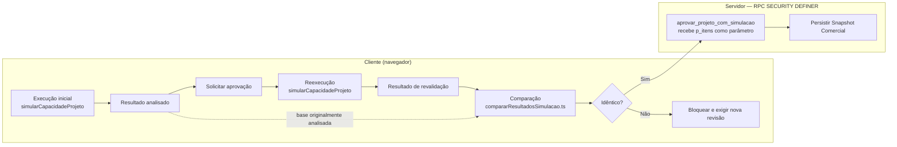

# PAD-008 — Motor de Capacidade

**Data:** 2026-07-30
**Versão:** 1.0
**Status:** Vigente
**Natureza do documento:** decisão de arquitetura permanente que
descreve as fronteiras, os contratos e as propriedades do Motor de
Capacidade, bem como sua realização técnica atual. Referenciado por
`DEC-004_Simulacao_Comercial.md`, que trata o Motor apenas como um
componente utilizado pela Simulação Comercial, sem descrever sua
arquitetura interna — essa descrição é o objeto deste documento.

---

## 1. Objetivo

Este documento descreve os componentes reais do Motor de Capacidade e
seus contratos de entrada e saída, descrevendo seu comportamento
determinístico no núcleo e os limites atuais de reprodução histórica e
auditoria. Não é uma proposta de redesenho.

## 2. Princípios

**Decisão arquitetural:** os princípios abaixo orientam a arquitetura
do Motor de Capacidade e devem ser preservados por qualquer evolução
futura:

- **Núcleo único para regras de avaliação** — as regras de consumo
  sequencial de capacidade, seleção analítica entre recurso original e
  compatíveis e identificação de déficit total pertencem ao núcleo e
  não devem ser duplicadas pelos consumidores. As regras de preparação
  das entradas permanecem no adaptador correspondente à origem da
  demanda.
- **Separação entre cálculo e decisão** — o Motor calcula viabilidade
  de capacidade; ele não decide aprovação, não assume risco comercial
  e não programa produção. Essas decisões pertencem a quem consome o
  resultado.
- **Núcleo determinístico para entradas completas idênticas** — dado
  um `EntradasMotor` idêntico, o núcleo sempre produz o mesmo
  resultado (ver seção 11).
- **Resultado por operação de roteiro** — Estado atual confirmado: o
  cálculo utiliza um item por operação de roteiro, identificado por
  `bomOperacaoId`, sem consolidação por recurso. Essa granularidade já
  está registrada na Arquitetura Vigente; não constitui decisão nova
  deste PAD.
- **Nenhuma duplicação das regras do núcleo** — qualquer novo
  consumidor deve utilizar o mesmo núcleo de avaliação e seu
  contrato, sem reimplementar as regras de seleção analítica de
  recurso ou cálculo de déficit.

## 3. Consumidores

**Estado atual confirmado:** o único consumidor funcional hoje é a
Simulação Comercial, por meio de `executarSimulacao.ts`.

**Evolução possível:** módulos que futuramente precisem avaliar
capacidade produtiva poderiam, em tese, reutilizar o núcleo do Motor —
sem nomear aqui nenhum módulo específico como compromisso de
integração.

## 4. Responsabilidades

**Estado atual confirmado:** o Motor é responsável por:

- Calcular a necessidade de horas de cada operação de roteiro.
- Avaliar se a capacidade disponível comporta essa necessidade.
- Realizar seleção analítica entre o recurso original e os recursos
  compatíveis cadastrados.
- Identificar déficit total por operação.
- Retornar o resultado por operação de roteiro.

## 5. Não-responsabilidades

**Estado atual confirmado:** o Motor não é responsável por:

- Aprovar a proposta comercial.
- Assumir risco comercial.
- Criar ou programar Ordens de Fabricação.
- Sequenciar produção.
- Definir data e horário operacional.
- Alocar equipe.
- Persistir o snapshot comercial.

## 6. Fluxo real de execução

**Estado atual confirmado:** o núcleo do Motor é atualmente acionado
exclusivamente pelo fluxo da Simulação Comercial, por meio da
orquestração e do adaptador comercial. Todo o fluxo de cálculo e
revalidação — execução inicial, reexecução e comparação — roda
inteiramente no cliente (navegador); só a persistência final cruza
para o servidor:

- **Execução inicial** — `simularCapacidadeProjeto` aciona o adaptador
  (`prepararEntradasMotor.ts`) e o núcleo
  (`motorAvaliacaoSequencial.ts`) no navegador, produzindo o resultado
  analisado pelo orçamentista.
- **Solicitar aprovação** — o orçamentista aciona o fluxo de
  aprovação.
- **Reexecução** — o mesmo caminho (adaptador + núcleo) roda de novo,
  também no navegador, produzindo o resultado de revalidação.
- **Comparação** — `compararResultadosSimulacao.ts` (já implementado)
  compara, campo a campo por operação, o resultado analisado com o
  resultado de revalidação — os mesmos campos que
  `aprovar_projeto_com_simulacao` persiste (ver seção 13). Se algo
  diferir, o fluxo bloqueia no cliente e exige nova revisão.
- **Persistência** — só se a comparação indicar identidade, o cliente
  chama `aprovarSimulacaoComercial`, que envia o resultado como
  parâmetro (`p_itens`) para a RPC `aprovar_projeto_com_simulacao`,
  do lado do servidor.

## 7. Divergência arquitetural conhecida

A revalidação obrigatória definida nos DEC-002 e DEC-004 é executada e
comparada no cliente. A RPC de aprovação valida a estrutura do
payload, mas não comprova que seus valores foram produzidos pelo
Motor nem os recalcula contra o estado corrente. Assim, a
implementação atual não garante no servidor a integridade do Snapshot
Comercial oficial e permanece vulnerável à adulteração intratenant e a
mudanças ocorridas entre revalidação e persistência.

Investigação de segurança dedicada confirma dois pontos adicionais:

- **Autorização:** a RPC é `SECURITY DEFINER`, com `search_path`
  fixado explicitamente (`set search_path to 'public'`) e `EXECUTE`
  revogado de `PUBLIC` e `anon` — só `authenticated` tem permissão de
  chamada. Porém, dentro do corpo da function, a única checagem é
  `empresa_atual_id()` (pertencer à mesma empresa do projeto) — não
  existe checagem de papel/cargo. Qualquer usuário autenticado da
  empresa, com qualquer função, pode chamar a RPC e persistir um
  Snapshot Comercial.
- **Atomicidade:** confirmado que a troca de `projetos.status` para
  `'aprovado'` e a gravação do snapshot ocorrem na mesma transação —
  sem controle de transação explícito na RPC, numa única chamada do
  cliente. Este ponto está corretamente implementado; não faz parte
  do risco descrito acima.

**Classificação:** risco alto de integridade e falha de autorização
funcional confirmada — qualquer usuário autenticado da empresa,
independentemente de papel/cargo, pode chamar a RPC e aprovar. A
divergência deve ser corrigida antes que o Snapshot Comercial seja
utilizado como garantia autoritativa de um compromisso real.

## 8. Decisão arquitetural

Um Snapshot Comercial oficial não deve depender da confiança em
cálculos enviados pelo cliente. O payload do cliente deve ser tratado
como não confiável. A revalidação autoritativa e a persistência
devem ocorrer sob controle do servidor, com consistência suficiente
para impedir alteração do estado relevante entre validação e
gravação.

A autorização da aprovação também deve ser validada no servidor
conforme a política funcional do Comercial. Estar autenticado e
pertencer à empresa não é autorização suficiente para aprovar um
cenário ou persistir seu Snapshot Comercial oficial.

## 9. Contratos de entrada e saída

**Estado atual confirmado**, por leitura direta de
`motorAvaliacaoSequencial.ts` e `executarSimulacao.ts`:

- Conversão minutos → horas ocorre dentro do núcleo, por operação:
  `tempoNecessarioHoras = (tempoEstimadoMinutos / 60) * quantidade`.
- Déficit total (nenhum recurso — original ou compatível — comporta a
  operação): `recursoConsideradoId` fica `null`, `motivoConsideracao`
  fica `null`, e o `deficit` booleano do núcleo fica `true` — sempre
  os três juntos, nunca parcial (operação indivisível, avaliada
  inteira em um único recurso).
- O Motor realiza seleção analítica do recurso considerado para
  avaliar capacidade: o recurso original entra com prioridade fixa,
  sempre avaliado primeiro; os recursos compatíveis cadastrados entram
  ordenados por prioridade ascendente. Essa seleção afeta o resultado
  da estimativa, mas não representa alocação operacional nem
  sequenciamento da produção.
- Dois formatos de déficit, mesma informação: o núcleo usa
  `deficit: boolean`; a camada pública (`ItemSimulacaoOperacao`)
  reexpressa isso como `deficit: number`, que só assume dois valores
  possíveis por operação — `necessario` (déficit total) ou `0`. Não
  existe déficit parcial em nenhuma das duas camadas.
- Granularidade: um item por operação de roteiro (`bomOperacaoId`) em
  todas as camadas — ver Princípios (seção 2).

## 10. Sequenciamento

**Estado atual confirmado:** o núcleo processa as operações de
roteiro na ordem em que chegam em `operacoesOrdenadas` (itens do
projeto por `created_at`, e dentro de cada item, pela ordem do
roteiro). Essa ordem, junto com a seleção analítica de recursos
(seção 9), determina qual operação recebe capacidade remanescente e
qual fica em déficit quando duas operações disputam o mesmo recurso —
a ordem afeta o resultado numérico da estimativa.

**Decisão arquitetural:** essa ordem de processamento não constitui
sequenciamento real de produção — não há data, horário, alocação
persistida, nem consideração de setup entre operações. Isso é
coerente com o limite já registrado na Arquitetura Vigente (seção 2):
a Simulação Comercial não sequencia operações; isso permanece
exclusivo do futuro módulo de PCP.

## 11. Determinismo

**Estado atual confirmado — núcleo:** `motorAvaliacaoSequencial.ts` é
determinístico dado um `EntradasMotor` idêntico — função pura, sem
I/O, sem dependência de ordem de retorno de rede.

**Estado atual confirmado — adaptador de entradas:** os mesmos 4
parâmetros superficiais (`empresaId`, `projetoId`, `janelaInicio`,
`janelaFim`) não garantem o mesmo resultado entre duas execuções,
porque `prepararEntradasMotor.ts` lê, a cada chamada, fontes que podem
mudar entre uma execução e outra: resolução de dias produtivos
(calendário operacional da empresa, calendário oficial de feriados e
eventos da empresa, consultados dia a dia sem cache); capacidade
diária cadastrada do recurso; produtividade efetiva do recurso ou
grupo; comprometido de outros projetos aprovados; compatibilidades
cadastradas entre recursos; e a estrutura do roteiro e dos itens do
projeto. Alterações nessas fontes podem mudar o resultado, mesmo com
os 4 parâmetros idênticos.

## 12. Reprodutibilidade

**Estado atual confirmado:** para simulações aprovadas, o sistema
preserva o resultado histórico por snapshot
(`simulacoes_comerciais`/`simulacao_comercial_itens`). Essas linhas
preservam o resultado aprovado conforme a regra de negócio vigente e
permitem consultar posteriormente a base registrada da decisão — não
garantem, porém, a reprodução integral da execução que gerou esse
resultado.

O que não fica congelado no snapshot: o BOM e as operações de roteiro
originais; os calendários (operacional, oficial e de eventos); a
produtividade cadastrada de recursos e grupos; as compatibilidades
entre recursos e suas prioridades; as capacidades cadastradas dos
recursos; o estado das simulações comerciais vigentes considerado no
cálculo do comprometimento; e a versão do algoritmo e das regras do
próprio Motor. Qualquer um desses elementos pode mudar depois da
aprovação sem que o snapshot registre a mudança — o snapshot preserva
o resultado, não as condições exatas que o produziram.

## 13. Critério de revalidação e aprovação

**Estado atual confirmado:** o critério técnico de revalidação —
comparação campo a campo por operação de roteiro, com a lista exata
de campos persistidos comparados — está detalhado em
`DEC-002_Aprovacao_Simulacao_Comercial.md`, seção "Regra de Negócio —
Critério de Revalidação". Este documento não repete esse
detalhamento. `DEC-004_Simulacao_Comercial.md`, seção "Aprovação
(Snapshot)", registra só o princípio geral em nível de negócio
(revalidação obrigatória, bloqueio quando algo relevante muda) — sem
o detalhamento técnico, que pertence ao DEC-002.

## 14. Relação com PCP/OF/operações materializadas

**Estado atual confirmado:** o Motor não lê Ordens de Fabricação nem
operações de produção materializadas. `calcular_comprometido_v1`
considera exclusivamente snapshots de simulações comerciais vigentes.
Não existe atualmente PCP operacional nem produção sendo executada
pelo sistema.

`ordens_fabricacao.bom_id` estabelece ancestralidade estrutural
indireta com o BOM e suas operações. Isso não representa consumo de
OF pelo Motor nem integração funcional entre os fluxos.

**Evidência de suporte:** a investigação que fundamenta este estado
atual está registrada no HANDOVER-002
(`HANDOVER-002_NEXOTFE_2026-07-29.md`).

## 15. "Cenário de Execução"

**Estado atual confirmado:** não existe hoje nenhuma estrutura
equivalente a "Cenário de Execução". `simularCapacidadeProjeto` recebe
só 4 parâmetros (`empresaId`, `projetoId`, `janelaInicio`,
`janelaFim`) — nenhum override de recurso, produtividade ou equipe. As
entradas atuais são montadas a partir do projeto, BOM, cadastros de
capacidade e produtividade, calendários, compatibilidades e snapshots
comerciais vigentes.

**Evolução possível:** se "Cenário de Execução" vier a ser construído,
seria um conceito genuinamente novo — não uma renomeação de algo
existente. Decisão de arquitetura fora do escopo desta versão.

## 16. Auditoria

**Estado atual confirmado:** para simulações aprovadas, o sistema
registra os parâmetros comerciais completos, quem aprovou, quando, e
o resultado por operação. Não registra: simulações pré-visualizadas
nunca aprovadas; quem rodou uma pré-visualização e quando; o resultado
de uma comparação de revalidação que aponta divergência (calculado e
exibido na tela, mas não persistido); tentativas de simulação
abandonadas antes da aprovação.

**Fora do escopo:** este PAD não decide persistir pré-visualizações.
Essa eventual decisão exige avaliação específica de finalidade,
volume, retenção, privacidade e custo operacional.

## 17. Evolução possível

Sem compromisso de roadmap:

- Reutilização do núcleo por outros módulos que venham a precisar
  avaliar capacidade produtiva (seção 3).
- Construção de um conceito de "Cenário de Execução" (seção 15).
- Integração entre o Motor e PCP/Ordens de Fabricação/operações de
  produção materializadas (seção 14).
- Persistência de pré-visualizações não aprovadas (seção 16), sujeita
  à avaliação descrita ali.
- Motor de Engenharia Reversa / Motor V2 e demais itens já registrados
  na Arquitetura Vigente, Seção 17 — Evolução Futura (fora do escopo
  da versão 1.0), não duplicados aqui.

Nenhuma das possibilidades acima é decidida por esta versão do
documento.

## 18. Referências

- `ARQUITETURA_VIGENTE_SIMULACAO_COMERCIAL_CAPACIDADE.md` — seções 2
  (Princípio Fundamental), 17 (Evolução Futura), 18 (Compatibilidade
  entre Recursos Produtivos e Motor de Avaliação Sequencial).
- `DEC-002_Aprovacao_Simulacao_Comercial.md` — critério técnico de
  revalidação (seção 13 deste documento).
- `DEC-004_Simulacao_Comercial.md` — papéis de negócio da Simulação
  Comercial; referencia este documento para a arquitetura interna do
  Motor.
- `HANDOVER-002_NEXOTFE_2026-07-29.md` — investigação original que
  originou este PAD, incluindo achados sobre o estado do repositório
  não repetidos aqui.
